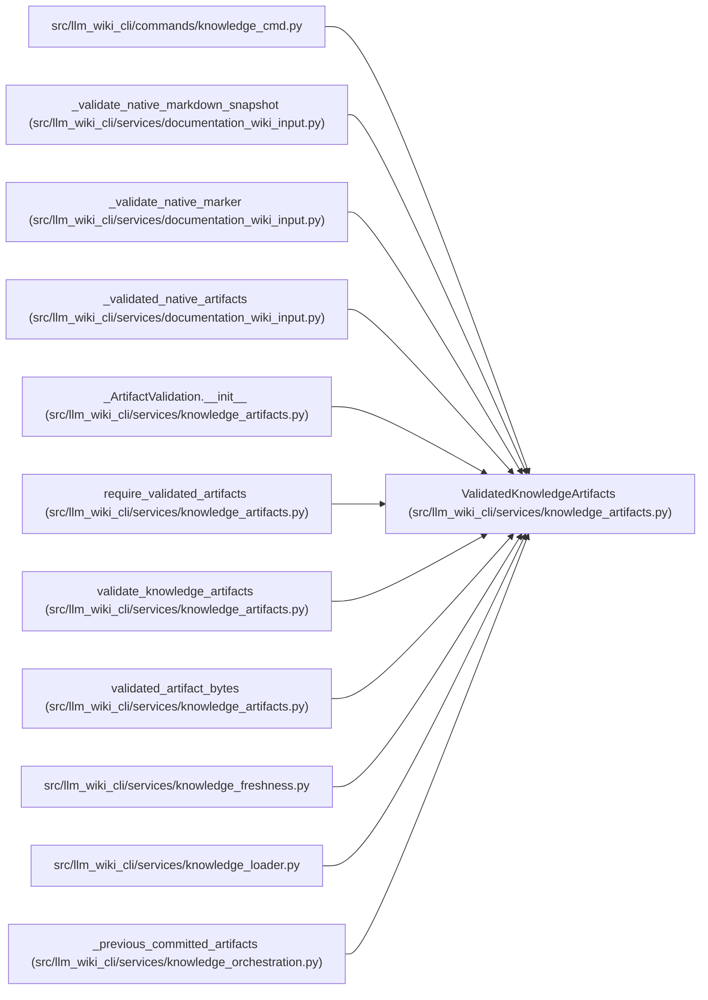

# ValidatedKnowledgeArtifacts

**Location:** `src/llm_wiki_cli/services/knowledge_artifacts.py:113`
**Kind:** Class
**Bases:** —
**Module:** [knowledge_artifacts](../modules/knowledge_artifacts.md)

**Decorators:** `@dataclass(frozen=True)`

## Description

Validated canonical projections and their exact-byte commitments.

## Attributes

| Name | Type | Default | Description |
|------|------|---------|-------------|
| `surface_payload` | `Mapping[str, Any]` | *required* | — |
| `knowledge` | `KnowledgeIndex` | *required* | — |
| `surface_index_hash` | `str` | *required* | — |
| `knowledge_index_hash` | `str` | *required* | — |
| `evaluated_envelope_hash` | `str` | *required* | — |
| `governance_hash` | `str \| None` | `None` | — |
| `_validation` | `_ArtifactValidation \| None` | `field(default=None, init=False, repr=False, compare=False)` | — |

## Methods

*No public methods. Inherits from base classes.*

## Relationships

<!-- Auto-generated relationship summary. Do not edit by hand. -->

### Summary

| Module | Methods | Attributes |
|---|---:|---|
| [knowledge_artifacts](../modules/knowledge_artifacts.md) | 0 | `_validation`, `evaluated_envelope_hash`, `governance_hash`, `knowledge`, `knowledge_index_hash`, `surface_index_hash`, `surface_payload` |

### References

| Reference | Kind | Source | Call sites |
|---|---|---|---:|
| `knowledge_cmd` | import | [knowledge_cmd](../modules/knowledge_cmd.md) | — |
| `_validate_native_markdown_snapshot` | type_reference | [documentation_wiki_input](../modules/documentation_wiki_input.md) | — |
| `_validate_native_marker` | type_reference | [documentation_wiki_input](../modules/documentation_wiki_input.md) | — |
| `_validated_native_artifacts` | type_reference | [documentation_wiki_input](../modules/documentation_wiki_input.md) | — |
| `_ArtifactValidation.__init__` | type_reference | [knowledge_artifacts](../modules/knowledge_artifacts.md) | — |
| `require_validated_artifacts` | type_reference | [knowledge_artifacts](../modules/knowledge_artifacts.md) | — |
| `validate_knowledge_artifacts` | call | [knowledge_artifacts](../modules/knowledge_artifacts.md) | 1 |
| `validate_knowledge_artifacts` | type_reference | [knowledge_artifacts](../modules/knowledge_artifacts.md) | — |
| `validated_artifact_bytes` | type_reference | [knowledge_artifacts](../modules/knowledge_artifacts.md) | — |
| `knowledge_freshness` | import | [knowledge_freshness](../modules/knowledge_freshness.md) | — |
| `knowledge_loader` | import | [knowledge_loader](../modules/knowledge_loader.md) | — |
| `_previous_committed_artifacts` | type_reference | [knowledge_orchestration](../modules/knowledge_orchestration.md) | — |
