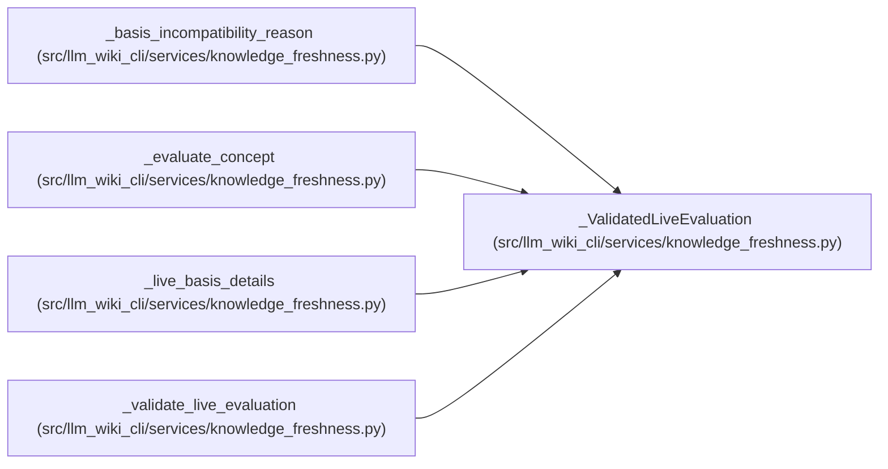

# _ValidatedLiveEvaluation

**Location:** `src/llm_wiki_cli/services/knowledge_freshness.py:211`
**Kind:** Class
**Bases:** —
**Module:** [knowledge_freshness](../modules/knowledge_freshness.md)

**Decorators:** `@dataclass(frozen=True)`

## Description

_Auto-generated from `_ValidatedLiveEvaluation` in `src/llm_wiki_cli/services/knowledge_freshness.py`._

## Attributes

| Name | Type | Default | Description |
|------|------|---------|-------------|
| `schema_version` | `str` | *required* | — |
| `producer` | `ProducerRecord` | *required* | — |
| `generation_options_hash` | `str` | *required* | — |
| `source_content_hashes` | `Mapping[str, str]` | *required* | — |
| `missing_source_paths` | `frozenset[str]` | *required* | — |
| `concept_bases` | `Mapping[str, ConceptObservationBasis]` | *required* | — |

## Methods

*No public methods. Inherits from base classes.*

## Relationships

<!-- Auto-generated relationship summary. Do not edit by hand. -->

### Summary

| Module | Methods | Attributes |
|---|---:|---|
| [knowledge_freshness](../modules/knowledge_freshness.md) | 0 | `concept_bases`, `generation_options_hash`, `missing_source_paths`, `producer`, `schema_version`, `source_content_hashes` |

### References

| Reference | Kind | Source | Call sites |
|---|---|---|---:|
| `_basis_incompatibility_reason` | type_reference | [knowledge_freshness](../modules/knowledge_freshness.md) | — |
| `_evaluate_concept` | type_reference | [knowledge_freshness](../modules/knowledge_freshness.md) | — |
| `_live_basis_details` | type_reference | [knowledge_freshness](../modules/knowledge_freshness.md) | — |
| `_validate_live_evaluation` | call | [knowledge_freshness](../modules/knowledge_freshness.md) | 1 |
| `_validate_live_evaluation` | type_reference | [knowledge_freshness](../modules/knowledge_freshness.md) | — |
