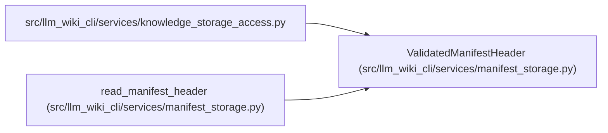

# ValidatedManifestHeader

**Location:** `src/llm_wiki_cli/services/manifest_storage.py:212`
**Kind:** Class
**Bases:** —
**Module:** [manifest_storage](../modules/manifest_storage.md)

**Decorators:** `@dataclass(frozen=True)`

## Description

An immutable view of committed generation policy, artifact hashes and the physical manifest version. It represents the fields needed by selected consumers and deliberately has no source, evidence or page-mapping collections. Complete operational state is obtained through `SyncManifest` reconstruction.

## Attributes

| Name | Type | Default | Description |
|------|------|---------|-------------|
| `generation_inputs` | `Mapping[str, Any]` | *required* | — |
| `artifact_hashes` | `ManifestArtifactHashes \| None` | *required* | — |
| `storage_version` | `int` | *required* | — |

## Methods

*No public methods. Inherits from base classes.*

## Relationships

<!-- Auto-generated relationship summary. Do not edit by hand. -->

### Summary

| Module | Methods | Attributes |
|---|---:|---|
| [manifest_storage](../modules/manifest_storage.md) | 0 | `artifact_hashes`, `generation_inputs`, `storage_version` |

### References

| Reference | Kind | Source | Call sites |
|---|---|---|---:|
| `knowledge_storage_access` | import | [knowledge_storage_access](../modules/knowledge_storage_access.md) | — |
| `read_manifest_header` | call | [manifest_storage](../modules/manifest_storage.md) | 2 |
| `read_manifest_header` | type_reference | [manifest_storage](../modules/manifest_storage.md) | — |
