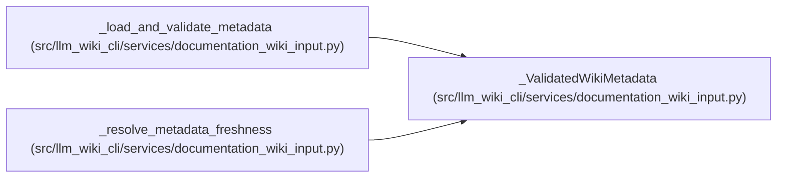

# _ValidatedWikiMetadata

**Location:** `src/llm_wiki_cli/services/documentation_wiki_input.py:402`
**Kind:** Class
**Bases:** —
**Module:** [documentation_wiki_input](../modules/documentation_wiki_input.md)

**Decorators:** `@dataclass(frozen=True)`

## Description

One fully classified metadata form built only from guarded input bytes.

## Attributes

| Name | Type | Default | Description |
|------|------|---------|-------------|
| `manifest_payload` | `Mapping[str, Any] \| None` | *required* | — |
| `surface_payload` | `Mapping[str, Any] \| None` | *required* | — |
| `sync_manifest` | `SyncManifest \| None` | *required* | — |
| `knowledge_artifacts` | `ValidatedKnowledgeArtifacts \| None` | *required* | — |
| `artifact_form` | `str` | *required* | — |
| `legacy_index_only` | `bool` | *required* | — |

## Methods

| Method | Signature | Decorators | Description |
|--------|-----------|------------|-------------|
| `manifest_version` | `() -> int \| None` | `@property` | — |
| `surface_schema_version` | `() -> str \| None` | `@property` | — |
| `knowledge_schema_version` | `() -> str \| None` | `@property` | — |

## Relationships

<!-- Auto-generated relationship summary. Do not edit by hand. -->

### Summary

| Module | Methods | Attributes |
|---|---:|---|
| [documentation_wiki_input](../modules/documentation_wiki_input.md) | 3 | `artifact_form`, `knowledge_artifacts`, `legacy_index_only`, `manifest_payload`, `surface_payload`, `sync_manifest` |

### References

| Reference | Kind | Source |
|---|---|---|
| `_load_and_validate_metadata` | call | [documentation_wiki_input](../modules/documentation_wiki_input.md) |
| `_load_and_validate_metadata` | call | [documentation_wiki_input](../modules/documentation_wiki_input.md) |
| `_load_and_validate_metadata` | call | [documentation_wiki_input](../modules/documentation_wiki_input.md) |
| `_load_and_validate_metadata` | call | [documentation_wiki_input](../modules/documentation_wiki_input.md) |
| `_load_and_validate_metadata` | type_reference | [documentation_wiki_input](../modules/documentation_wiki_input.md) |
| `_resolve_metadata_freshness` | type_reference | [documentation_wiki_input](../modules/documentation_wiki_input.md) |
