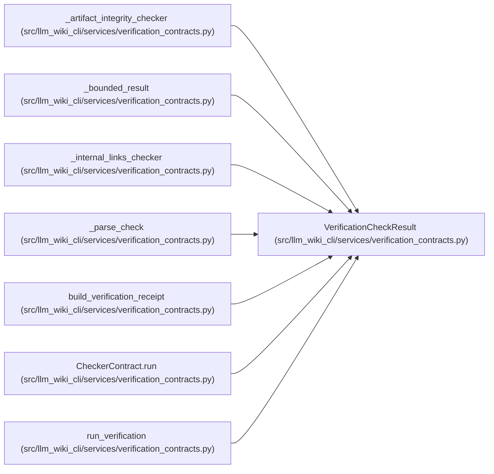

# VerificationCheckResult

**Location:** `src/llm_wiki_cli/services/verification_contracts.py:187`
**Kind:** Class
**Bases:** —
**Module:** [verification_contracts](../modules/verification_contracts.md)

**Decorators:** `@dataclass(frozen=True)`

## Description

Normalized output from one application-owned checker.

## Attributes

| Name | Type | Default | Description |
|------|------|---------|-------------|
| `checker_id` | `str` | *required* | — |
| `checker_version` | `str` | *required* | — |
| `result` | `VerificationResult` | *required* | — |
| `diagnostics` | `tuple[VerificationDiagnostic, ...]` | `()` | — |
| `diagnostic_coverage` | `DiagnosticCoverage` | `field(default_factory=lambda: DiagnosticCoverage(observed=0, emitted=0, omitted=0))` | — |

## Methods

| Method | Signature | Decorators | Description |
|--------|-----------|------------|-------------|
| `__post_init__` | `() -> None` | — | — |
| `to_payload` | `() -> dict[str, object]` | — | — |

## Relationships

<!-- Auto-generated relationship summary. Do not edit by hand. -->

### Summary

| Module | Methods | Attributes |
|---|---:|---|
| [verification_contracts](../modules/verification_contracts.md) | 2 | `checker_id`, `checker_version`, `diagnostic_coverage`, `diagnostics`, `result` |

### References

| Reference | Kind | Source |
|---|---|---|
| `_artifact_integrity_checker` | type_reference | [verification_contracts](../modules/verification_contracts.md) |
| `_bounded_result` | call | [verification_contracts](../modules/verification_contracts.md) |
| `_bounded_result` | type_reference | [verification_contracts](../modules/verification_contracts.md) |
| `_internal_links_checker` | type_reference | [verification_contracts](../modules/verification_contracts.md) |
| `_parse_check` | call | [verification_contracts](../modules/verification_contracts.md) |
| `_parse_check` | type_reference | [verification_contracts](../modules/verification_contracts.md) |
| `build_verification_receipt` | type_reference | [verification_contracts](../modules/verification_contracts.md) |
| `CheckerContract.run` | type_reference | [verification_contracts](../modules/verification_contracts.md) |
| `run_verification` | type_reference | [verification_contracts](../modules/verification_contracts.md) |
