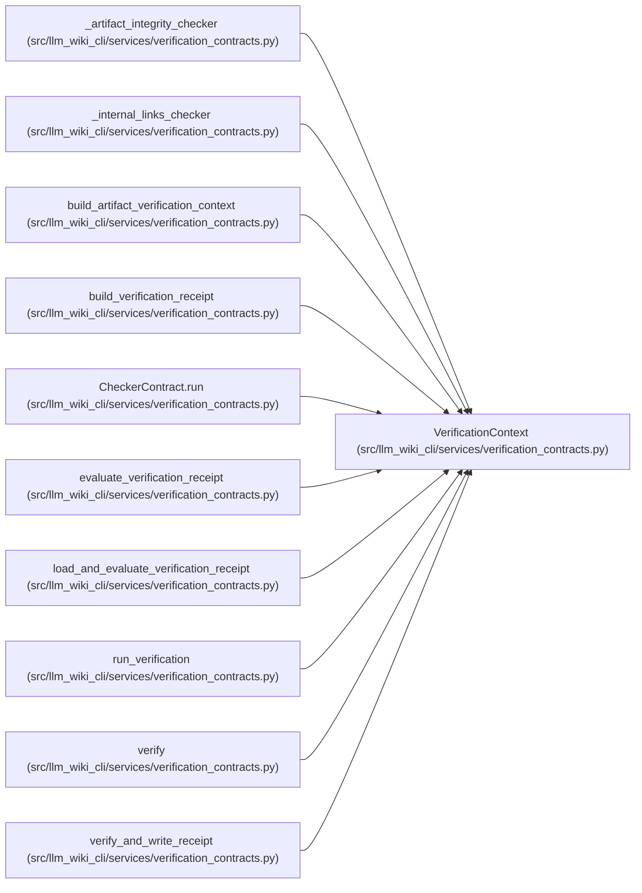

# VerificationContext

**Location:** `src/llm_wiki_cli/services/verification_contracts.py:244`
**Kind:** Class
**Bases:** —
**Module:** [verification_contracts](../modules/verification_contracts.md)

**Decorators:** `@dataclass(frozen=True)`

## Description

All already evaluated inputs available to pure checkers.

## Attributes

| Name | Type | Default | Description |
|------|------|---------|-------------|
| `knowledge` | `KnowledgeIndex` | *required* | — |
| `knowledge_hash` | `str` | *required* | — |
| `scope_uid` | `str` | *required* | — |
| `scope_hash` | `str` | *required* | — |
| `evidence` | `Mapping[str, str]` | *required* | — |
| `evaluated_snapshot` | `Mapping[str, str]` | *required* | — |
| `scope_locator` | `str \| None` | `None` | — |
| `artifact_integrity` | `bool` | `True` | — |
| `artifact_diagnostics` | `tuple[VerificationDiagnostic, ...]` | `()` | — |

## Methods

| Method | Signature | Decorators | Description |
|--------|-----------|------------|-------------|
| `__post_init__` | `() -> None` | — | — |
| `evidence_hash` | `() -> str` | `@property` | — |
| `snapshot_hash` | `() -> str` | `@property` | — |

## Relationships

<!-- Auto-generated relationship summary. Do not edit by hand. -->

### Summary

| Module | Methods | Attributes |
|---|---:|---|
| [verification_contracts](../modules/verification_contracts.md) | 3 | `artifact_diagnostics`, `artifact_integrity`, `evaluated_snapshot`, `evidence`, `knowledge`, `knowledge_hash`, `scope_hash`, `scope_locator`, `scope_uid` |

### References

| Reference | Kind | Source | Call sites |
|---|---|---|---:|
| `_artifact_integrity_checker` | type_reference | [verification_contracts](../modules/verification_contracts.md) | — |
| `_internal_links_checker` | type_reference | [verification_contracts](../modules/verification_contracts.md) | — |
| `build_artifact_verification_context` | call | [verification_contracts](../modules/verification_contracts.md) | 1 |
| `build_artifact_verification_context` | type_reference | [verification_contracts](../modules/verification_contracts.md) | — |
| `build_verification_receipt` | type_reference | [verification_contracts](../modules/verification_contracts.md) | — |
| `CheckerContract.run` | type_reference | [verification_contracts](../modules/verification_contracts.md) | — |
| `evaluate_verification_receipt` | type_reference | [verification_contracts](../modules/verification_contracts.md) | — |
| `load_and_evaluate_verification_receipt` | type_reference | [verification_contracts](../modules/verification_contracts.md) | — |
| `run_verification` | type_reference | [verification_contracts](../modules/verification_contracts.md) | — |
| `verify` | type_reference | [verification_contracts](../modules/verification_contracts.md) | — |
| `verify_and_write_receipt` | type_reference | [verification_contracts](../modules/verification_contracts.md) | — |
