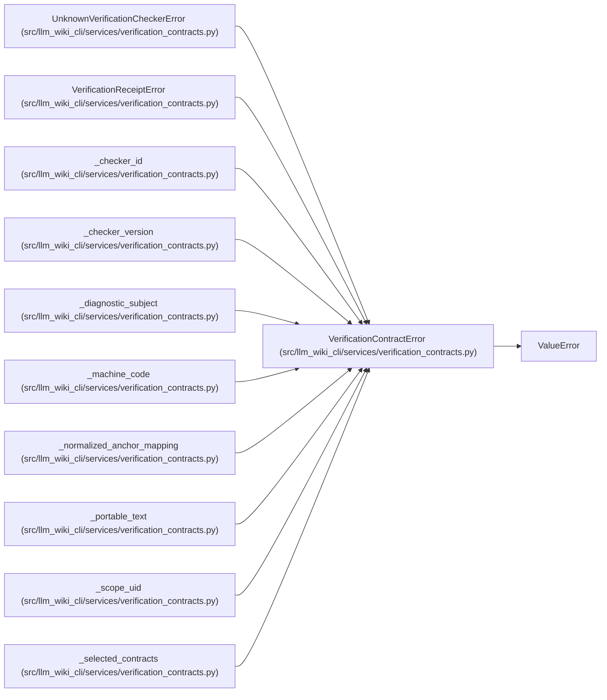

# VerificationContractError

**Location:** `src/llm_wiki_cli/services/verification_contracts.py:75`
**Kind:** Class
**Bases:** `ValueError`
**Module:** [verification_contracts](../modules/verification_contracts.md)

## Description

Base error for verification inputs, checkers, and receipts.

## Attributes

*No annotated attributes found.*

## Methods

*No public methods. Inherits from base classes.*

## Relationships

<!-- Auto-generated relationship summary. Do not edit by hand. -->

### Summary

| Module | Methods | Attributes |
|---|---:|---|
| [verification_contracts](../modules/verification_contracts.md) | 0 | — |

### Structure

| Kind | Entity | Module |
|---|---|---|
| Base | `ValueError` | — |
| Subclass | `UnknownVerificationCheckerError` | [verification_contracts](../modules/verification_contracts.md) |
| Subclass | `VerificationReceiptError` | [verification_contracts](../modules/verification_contracts.md) |

### References

| Reference | Kind | Source |
|---|---|---|
| `_checker_id` | call | [verification_contracts](../modules/verification_contracts.md) |
| `_checker_version` | call | [verification_contracts](../modules/verification_contracts.md) |
| `_diagnostic_subject` | call | [verification_contracts](../modules/verification_contracts.md) |
| `_machine_code` | call | [verification_contracts](../modules/verification_contracts.md) |
| `_normalized_anchor_mapping` | call | [verification_contracts](../modules/verification_contracts.md) |
| `_normalized_anchor_mapping` | call | [verification_contracts](../modules/verification_contracts.md) |
| `_normalized_anchor_mapping` | call | [verification_contracts](../modules/verification_contracts.md) |
| `_portable_text` | call | [verification_contracts](../modules/verification_contracts.md) |
| `_scope_uid` | call | [verification_contracts](../modules/verification_contracts.md) |
| `_selected_contracts` | call | [verification_contracts](../modules/verification_contracts.md) |
| `_selected_contracts` | call | [verification_contracts](../modules/verification_contracts.md) |
| `_selected_contracts` | call | [verification_contracts](../modules/verification_contracts.md) |
