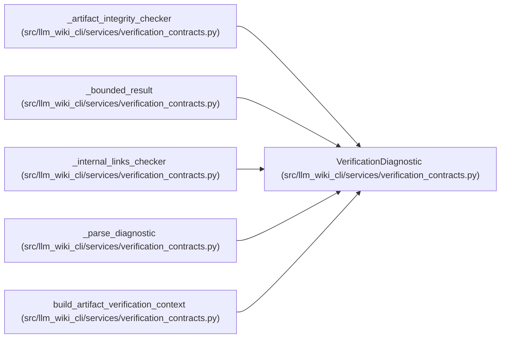

# VerificationDiagnostic

**Location:** `src/llm_wiki_cli/services/verification_contracts.py:115`
**Kind:** Class
**Bases:** —
**Module:** [verification_contracts](../modules/verification_contracts.md)

**Decorators:** `@dataclass(frozen=True)`

## Description

One bounded, path-safe machine diagnostic.

Diagnostics intentionally carry no free-form message or source snippet.
``subject`` is an optional portable identifier such as a knowledge locator
or artifact field.

## Attributes

| Name | Type | Default | Description |
|------|------|---------|-------------|
| `code` | `str` | *required* | — |
| `subject` | `str \| None` | `None` | — |

## Methods

| Method | Signature | Decorators | Description |
|--------|-----------|------------|-------------|
| `__post_init__` | `() -> None` | — | — |
| `to_payload` | `() -> dict[str, str]` | — | — |

## Relationships

<!-- Auto-generated relationship summary. Do not edit by hand. -->

### Summary

| Module | Methods | Attributes |
|---|---:|---|
| [verification_contracts](../modules/verification_contracts.md) | 2 | `code`, `subject` |

### References

| Reference | Kind | Source | Call sites |
|---|---|---|---:|
| `_artifact_integrity_checker` | call | [verification_contracts](../modules/verification_contracts.md) | 1 |
| `_bounded_result` | type_reference | [verification_contracts](../modules/verification_contracts.md) | — |
| `_internal_links_checker` | call | [verification_contracts](../modules/verification_contracts.md) | 1 |
| `_parse_diagnostic` | call | [verification_contracts](../modules/verification_contracts.md) | 1 |
| `_parse_diagnostic` | type_reference | [verification_contracts](../modules/verification_contracts.md) | — |
| `build_artifact_verification_context` | type_reference | [verification_contracts](../modules/verification_contracts.md) | — |
