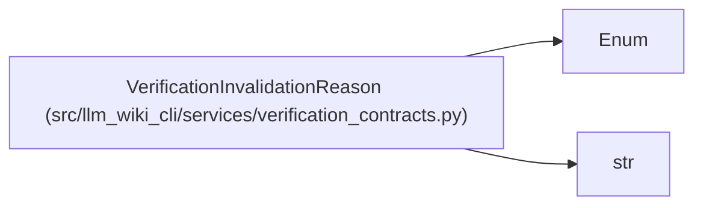

# VerificationInvalidationReason

**Location:** `src/llm_wiki_cli/services/verification_contracts.py:103`
**Kind:** Enum
**Bases:** `str`, `Enum`
**Module:** [verification_contracts](../modules/verification_contracts.md)

## Description

Reasons a syntactically valid receipt is not current.

## Attributes

| Name | Declared value | Description |
|------|-------|-------------|
| `KNOWLEDGE_CHANGED` | `'knowledge-changed'` | — |
| `SCOPE_CHANGED` | `'scope-changed'` | — |
| `EVIDENCE_CHANGED` | `'evidence-changed'` | — |
| `SNAPSHOT_CHANGED` | `'snapshot-changed'` | — |
| `UNKNOWN_CHECKER` | `'unknown-checker'` | — |
| `CHECKER_VERSION_CHANGED` | `'checker-version-changed'` | — |

## Methods

*No public methods. Inherits from base classes.*

## Relationships

<!-- Auto-generated relationship summary. Do not edit by hand. -->

### Summary

| Module | Methods | Attributes |
|---|---:|---|
| [verification_contracts](../modules/verification_contracts.md) | 0 | `CHECKER_VERSION_CHANGED`, `EVIDENCE_CHANGED`, `KNOWLEDGE_CHANGED`, `SCOPE_CHANGED`, `SNAPSHOT_CHANGED`, `UNKNOWN_CHECKER` |

### Structure

| Kind | Entity | Module |
|---|---|---|
| Base | `Enum` | — |
| Base | `str` | — |
