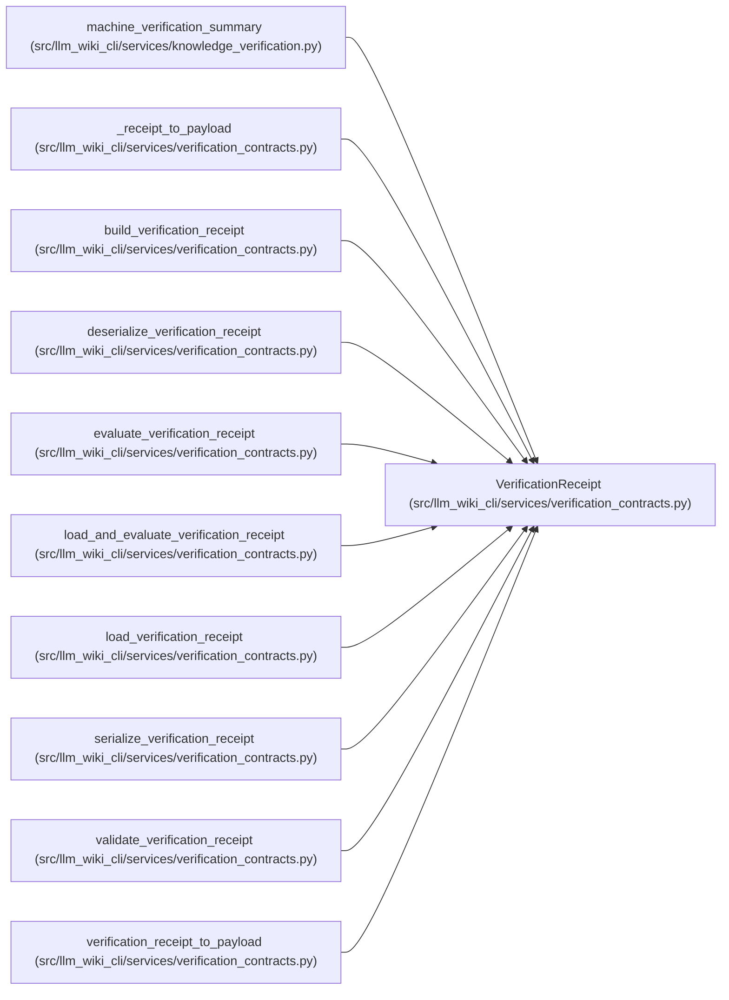

# VerificationReceipt

**Location:** `src/llm_wiki_cli/services/verification_contracts.py:453`
**Kind:** Class
**Bases:** —
**Module:** [verification_contracts](../modules/verification_contracts.md)

**Decorators:** `@dataclass(frozen=True)`

## Description

Deterministic recorded evidence from one explicit verification run.

## Attributes

| Name | Type | Default | Description |
|------|------|---------|-------------|
| `knowledge_hash` | `str` | *required* | — |
| `scope_uid` | `str` | *required* | — |
| `scope_hash` | `str` | *required* | — |
| `evidence` | `Mapping[str, str]` | *required* | — |
| `evidence_hash` | `str` | *required* | — |
| `evaluated_snapshot` | `Mapping[str, str]` | *required* | — |
| `snapshot_hash` | `str` | *required* | — |
| `result` | `VerificationResult` | *required* | — |
| `checks` | `tuple[VerificationCheckResult, ...]` | *required* | — |
| `schema_version` | `str` | `VERIFICATION_RECEIPT_SCHEMA_VERSION` | — |

## Methods

| Method | Signature | Decorators | Description |
|--------|-----------|------------|-------------|
| `__post_init__` | `() -> None` | — | — |
| `to_payload` | `() -> dict[str, object]` | — | — |

## Relationships

<!-- Auto-generated relationship summary. Do not edit by hand. -->

### Summary

| Module | Methods | Attributes |
|---|---:|---|
| [verification_contracts](../modules/verification_contracts.md) | 2 | `checks`, `evaluated_snapshot`, `evidence`, `evidence_hash`, `knowledge_hash`, `result`, `schema_version`, `scope_hash`, `scope_uid`, `snapshot_hash` |

### References

| Reference | Kind | Source |
|---|---|---|
| `machine_verification_summary` | type_reference | [knowledge_verification](../modules/knowledge_verification.md) |
| `_receipt_to_payload` | type_reference | [verification_contracts](../modules/verification_contracts.md) |
| `build_verification_receipt` | call | [verification_contracts](../modules/verification_contracts.md) |
| `build_verification_receipt` | type_reference | [verification_contracts](../modules/verification_contracts.md) |
| `deserialize_verification_receipt` | type_reference | [verification_contracts](../modules/verification_contracts.md) |
| `evaluate_verification_receipt` | type_reference | [verification_contracts](../modules/verification_contracts.md) |
| `load_and_evaluate_verification_receipt` | type_reference | [verification_contracts](../modules/verification_contracts.md) |
| `load_verification_receipt` | type_reference | [verification_contracts](../modules/verification_contracts.md) |
| `serialize_verification_receipt` | type_reference | [verification_contracts](../modules/verification_contracts.md) |
| `validate_verification_receipt` | call | [verification_contracts](../modules/verification_contracts.md) |
| `validate_verification_receipt` | type_reference | [verification_contracts](../modules/verification_contracts.md) |
| `verification_receipt_to_payload` | type_reference | [verification_contracts](../modules/verification_contracts.md) |
