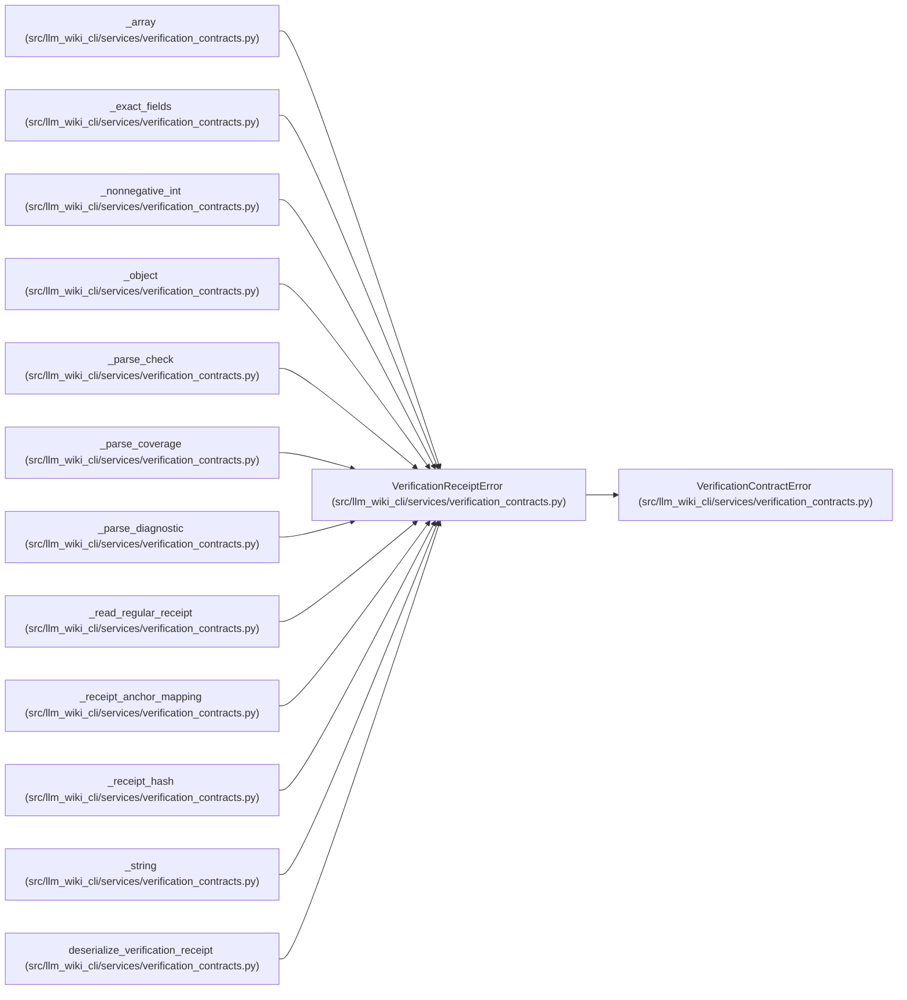

# VerificationReceiptError

**Location:** `src/llm_wiki_cli/services/verification_contracts.py:87`
**Kind:** Class
**Bases:** `VerificationContractError`
**Module:** [verification_contracts](../modules/verification_contracts.md)

## Description

Field-specific failure for a verification receipt.

## Attributes

*No annotated attributes found.*

## Methods

| Method | Signature | Decorators | Description |
|--------|-----------|------------|-------------|
| `__init__` | `(field: str, message: str)` | — | — |

## Relationships

<!-- Auto-generated relationship summary. Do not edit by hand. -->

### Summary

| Module | Methods | Attributes |
|---|---:|---|
| [verification_contracts](../modules/verification_contracts.md) | 1 | — |

### Structure

| Kind | Entity | Module |
|---|---|---|
| Base | `VerificationContractError` | [verification_contracts](../modules/verification_contracts.md) |

### References

| Reference | Kind | Source | Call sites |
|---|---|---|---:|
| `_array` | call | [verification_contracts](../modules/verification_contracts.md) | 1 |
| `_exact_fields` | call | [verification_contracts](../modules/verification_contracts.md) | 3 |
| `_nonnegative_int` | call | [verification_contracts](../modules/verification_contracts.md) | 1 |
| `_object` | call | [verification_contracts](../modules/verification_contracts.md) | 2 |
| `_parse_check` | call | [verification_contracts](../modules/verification_contracts.md) | 7 |
| `_parse_coverage` | call | [verification_contracts](../modules/verification_contracts.md) | 2 |
| `_parse_diagnostic` | call | [verification_contracts](../modules/verification_contracts.md) | 1 |
| `_read_regular_receipt` | call | [verification_contracts](../modules/verification_contracts.md) | 7 |
| `_receipt_anchor_mapping` | call | [verification_contracts](../modules/verification_contracts.md) | 1 |
| `_receipt_hash` | call | [verification_contracts](../modules/verification_contracts.md) | 1 |
| `_string` | call | [verification_contracts](../modules/verification_contracts.md) | 1 |
| `deserialize_verification_receipt` | call | [verification_contracts](../modules/verification_contracts.md) | 4 |

> References: showing 12 of 17 logical references; 5 omitted by the 12-row generated summary limit.
