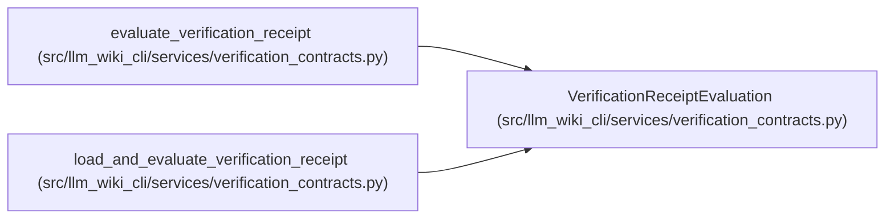

# VerificationReceiptEvaluation

**Location:** `src/llm_wiki_cli/services/verification_contracts.py:537`
**Kind:** Class
**Bases:** —
**Module:** [verification_contracts](../modules/verification_contracts.md)

**Decorators:** `@dataclass(frozen=True)`

## Description

Live validity of one recorded receipt against current anchors.

## Attributes

| Name | Type | Default | Description |
|------|------|---------|-------------|
| `receipt` | `VerificationReceipt` | *required* | — |
| `valid` | `bool` | *required* | — |
| `reasons` | `tuple[VerificationInvalidationReason, ...]` | `()` | — |

## Methods

| Method | Signature | Decorators | Description |
|--------|-----------|------------|-------------|
| `__post_init__` | `() -> None` | — | — |
| `recorded_result` | `() -> VerificationResult` | `@property` | — |

## Relationships

<!-- Auto-generated relationship summary. Do not edit by hand. -->

### Summary

| Module | Methods | Attributes |
|---|---:|---|
| [verification_contracts](../modules/verification_contracts.md) | 2 | `reasons`, `receipt`, `valid` |

### References

| Reference | Kind | Source |
|---|---|---|
| `evaluate_verification_receipt` | call | [verification_contracts](../modules/verification_contracts.md) |
| `evaluate_verification_receipt` | type_reference | [verification_contracts](../modules/verification_contracts.md) |
| `load_and_evaluate_verification_receipt` | type_reference | [verification_contracts](../modules/verification_contracts.md) |
