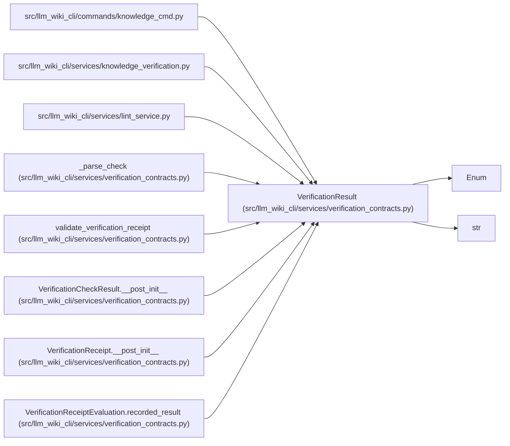

# VerificationResult

**Location:** `src/llm_wiki_cli/services/verification_contracts.py:96`
**Kind:** Enum
**Bases:** `str`, `Enum`
**Module:** [verification_contracts](../modules/verification_contracts.md)

## Description

A recorded checker result at one evaluated snapshot.

## Attributes

| Name | Declared value | Description |
|------|-------|-------------|
| `PASSED` | `'passed'` | — |
| `FAILED` | `'failed'` | — |

## Methods

*No public methods. Inherits from base classes.*

## Relationships

<!-- Auto-generated relationship summary. Do not edit by hand. -->

### Summary

| Module | Methods | Attributes |
|---|---:|---|
| [verification_contracts](../modules/verification_contracts.md) | 0 | `FAILED`, `PASSED` |

### Structure

| Kind | Entity | Module |
|---|---|---|
| Base | `Enum` | — |
| Base | `str` | — |

### References

| Reference | Kind | Source |
|---|---|---|
| `knowledge_cmd` | import | [knowledge_cmd](../modules/knowledge_cmd.md) |
| `knowledge_verification` | import | [knowledge_verification](../modules/knowledge_verification.md) |
| `lint_service` | import | [lint_service](../modules/lint_service.md) |
| `_parse_check` | call | [verification_contracts](../modules/verification_contracts.md) |
| `validate_verification_receipt` | call | [verification_contracts](../modules/verification_contracts.md) |
| `VerificationCheckResult.__post_init__` | call | [verification_contracts](../modules/verification_contracts.md) |
| `VerificationReceipt.__post_init__` | call | [verification_contracts](../modules/verification_contracts.md) |
| `VerificationReceiptEvaluation.recorded_result` | type_reference | [verification_contracts](../modules/verification_contracts.md) |
