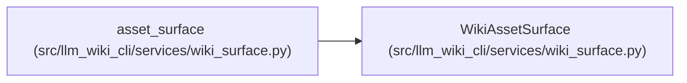

# WikiAssetSurface

**Location:** `src/llm_wiki_cli/services/wiki_surface.py:82`
**Kind:** Class
**Bases:** —
**Module:** [wiki_surface](../modules/wiki_surface.md)

**Decorators:** `@dataclass(frozen=True)`

## Description

_Auto-generated from `WikiAssetSurface` in `src/llm_wiki_cli/services/wiki_surface.py`._

## Attributes

| Name | Type | Default | Description |
|------|------|---------|-------------|
| `label` | `str` | *required* | — |
| `directory` | `str` | *required* | — |
| `path_pattern` | `str` | *required* | — |
| `role` | `SurfaceRole` | *required* | — |
| `layout` | `str` | *required* | — |
| `generated` | `bool` | *required* | — |

## Methods

*No public methods. Inherits from base classes.*

## Relationships

<!-- Auto-generated relationship summary. Do not edit by hand. -->

### Summary

| Module | Methods | Attributes |
|---|---:|---|
| [wiki_surface](../modules/wiki_surface.md) | 0 | `directory`, `generated`, `label`, `layout`, `path_pattern`, `role` |

### References

| Reference | Kind | Source |
|---|---|---|
| `asset_surface` | type_reference | [wiki_surface](../modules/wiki_surface.md) |
