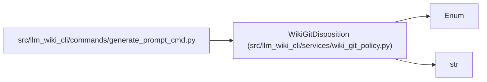

# WikiGitDisposition

**Location:** `src/llm_wiki_cli/services/wiki_git_policy.py:42`
**Kind:** Enum
**Bases:** `str`, `Enum`
**Module:** [wiki_git_policy](../modules/wiki_git_policy.md)

## Description

Whether Git permits wiki handoff instructions for a path.

## Attributes

| Name | Declared value | Description |
|------|-------|-------------|
| `INCLUDED` | `'included'` | — |
| `IGNORED` | `'ignored'` | — |
| `INDETERMINATE` | `'indeterminate'` | — |

## Methods

*No public methods. Inherits from base classes.*

## Relationships

<!-- Auto-generated relationship summary. Do not edit by hand. -->

### Summary

| Module | Methods | Attributes |
|---|---:|---|
| [wiki_git_policy](../modules/wiki_git_policy.md) | 0 | `IGNORED`, `INCLUDED`, `INDETERMINATE` |

### Structure

| Kind | Entity | Module |
|---|---|---|
| Base | `Enum` | — |
| Base | `str` | — |

### References

| Reference | Kind | Source | Call sites |
|---|---|---|---:|
| `generate_prompt_cmd` | import | [generate_prompt_cmd](../modules/generate_prompt_cmd.md) | — |
