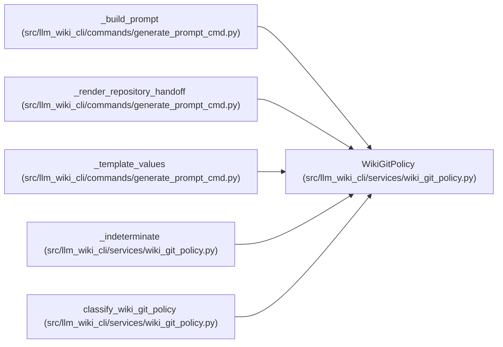

# WikiGitPolicy

**Location:** `src/llm_wiki_cli/services/wiki_git_policy.py:51`
**Kind:** Class
**Bases:** —
**Module:** [wiki_git_policy](../modules/wiki_git_policy.md)

**Decorators:** `@dataclass(frozen=True)`

## Description

A bounded, non-sensitive result from local Git policy evaluation.

## Attributes

| Name | Type | Default | Description |
|------|------|---------|-------------|
| `disposition` | `WikiGitDisposition` | *required* | — |
| `reason` | `str` | *required* | — |
| `repository_root` | `Path \| None` | `None` | — |
| `wiki_path` | `str \| None` | `None` | — |

## Methods

| Method | Signature | Decorators | Description |
|--------|-----------|------------|-------------|
| `allows_commit_guidance` | `() -> bool` | `@property` | Return whether callers may consider separately authorized guidance. |

## Relationships

<!-- Auto-generated relationship summary. Do not edit by hand. -->

### Summary

| Module | Methods | Attributes |
|---|---:|---|
| [wiki_git_policy](../modules/wiki_git_policy.md) | 1 | `disposition`, `reason`, `repository_root`, `wiki_path` |

### References

| Reference | Kind | Source | Call sites |
|---|---|---|---:|
| `_build_prompt` | type_reference | [generate_prompt_cmd](../modules/generate_prompt_cmd.md) | — |
| `_render_repository_handoff` | type_reference | [generate_prompt_cmd](../modules/generate_prompt_cmd.md) | — |
| `_template_values` | type_reference | [generate_prompt_cmd](../modules/generate_prompt_cmd.md) | — |
| `_indeterminate` | call | [wiki_git_policy](../modules/wiki_git_policy.md) | 1 |
| `_indeterminate` | type_reference | [wiki_git_policy](../modules/wiki_git_policy.md) | — |
| `classify_wiki_git_policy` | call | [wiki_git_policy](../modules/wiki_git_policy.md) | 2 |
| `classify_wiki_git_policy` | type_reference | [wiki_git_policy](../modules/wiki_git_policy.md) | — |
