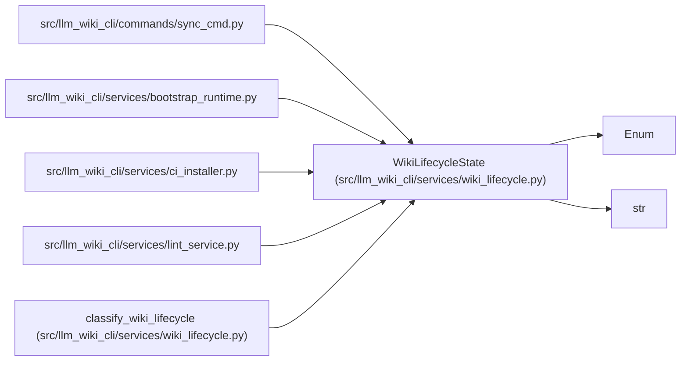

# WikiLifecycleState

**Location:** `src/llm_wiki_cli/services/wiki_lifecycle.py:130`
**Kind:** Enum
**Bases:** `str`, `Enum`
**Module:** [wiki_lifecycle](../modules/wiki_lifecycle.md)

## Description

One unambiguous lifecycle route for a wiki target.

## Attributes

| Name | Declared value | Description |
|------|-------|-------------|
| `FIRST_USE` | `'first-use'` | — |
| `SYNC_SEEDABLE` | `'sync-seedable'` | — |
| `MIGRATION_REQUIRED` | `'migration-required'` | — |
| `MANAGED` | `'managed'` | — |

## Methods

*No public methods. Inherits from base classes.*

## Relationships

<!-- Auto-generated relationship summary. Do not edit by hand. -->

### Summary

| Module | Methods | Attributes |
|---|---:|---|
| [wiki_lifecycle](../modules/wiki_lifecycle.md) | 0 | `FIRST_USE`, `MANAGED`, `MIGRATION_REQUIRED`, `SYNC_SEEDABLE` |

### Structure

| Kind | Entity | Module |
|---|---|---|
| Base | `Enum` | — |
| Base | `str` | — |

### References

| Reference | Kind | Source | Call sites |
|---|---|---|---:|
| `sync_cmd` | import | [sync_cmd](../modules/sync_cmd.md) | — |
| `bootstrap_runtime` | import | [bootstrap_runtime](../modules/bootstrap_runtime.md) | — |
| `ci_installer` | import | [ci_installer](../modules/ci_installer.md) | — |
| `lint_service` | import | [lint_service](../modules/lint_service.md) | — |
| `classify_wiki_lifecycle` | type_reference | [wiki_lifecycle](../modules/wiki_lifecycle.md) | — |
