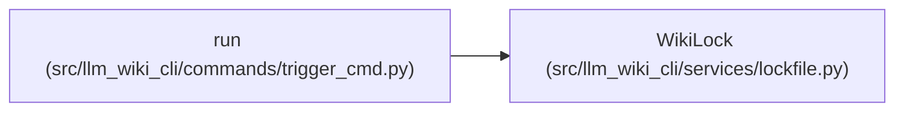

# WikiLock

**Location:** `src/llm_wiki_cli/services/lockfile.py:26`
**Kind:** Class
**Bases:** —
**Module:** [lockfile](../modules/lockfile.md)

## Description

Exclusive file lock to prevent concurrent wiki syncs.

Uses fcntl.flock() on POSIX and msvcrt.locking() on Windows
for non-blocking exclusive locking on .git/llm-wiki.lock.  Contention
remains fail-fast by default; ``wait_seconds`` enables bounded polling.

## Attributes

*No annotated attributes found.*

## Methods

| Method | Signature | Decorators | Description |
|--------|-----------|------------|-------------|
| `__init__` | `(git_dir: Path = Path('.git'), wait_seconds: float = 0)` | — | — |
| `__enter__` | `()` | — | — |
| `_acquire_before_deadline` | `() -> None` | — | — |
| `_acquire_once` | `() -> None` | — | — |
| `__exit__` | `(exc_type, exc_val, exc_tb)` | — | — |

## Relationships

<!-- Auto-generated relationship summary. Do not edit by hand. -->

### Summary

| Module | Methods | Attributes |
|---|---:|---|
| [lockfile](../modules/lockfile.md) | 5 | — |

### References

| Reference | Kind | Source |
|---|---|---|
| `run` | call | [trigger_cmd](../modules/trigger_cmd.md) |
