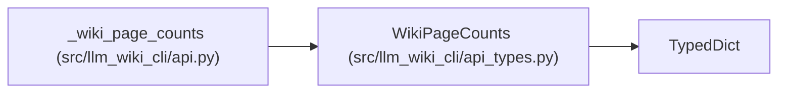

# WikiPageCounts

**Location:** `src/llm_wiki_cli/api_types.py:149`
**Kind:** Class
**Bases:** `TypedDict`
**Module:** [api_types](../modules/api_types.md)

## Description

Counts returned with a wiki-page listing.

## Attributes

| Name | Type | Default | Description |
|------|------|---------|-------------|
| `total` | `int` | *required* | — |
| `by_kind` | `dict[str, int]` | *required* | — |
| `architecture_pages` | `int` | *required* | — |

## Methods

*No public methods. Inherits from base classes.*

## Relationships

<!-- Auto-generated relationship summary. Do not edit by hand. -->

### Summary

| Module | Methods | Attributes |
|---|---:|---|
| [api_types](../modules/api_types.md) | 0 | `architecture_pages`, `by_kind`, `total` |

### Structure

| Kind | Entity | Module |
|---|---|---|
| Base | `TypedDict` | — |

### References

| Reference | Kind | Source |
|---|---|---|
| `_wiki_page_counts` | type_reference | [api](../modules/api.md) |
