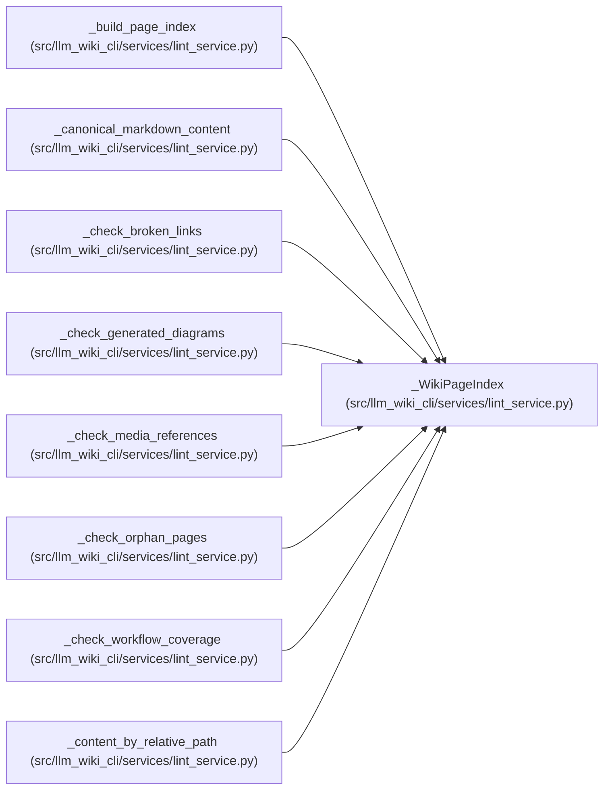

# _WikiPageIndex

**Location:** `src/llm_wiki_cli/services/lint_service.py:308`
**Kind:** Class
**Bases:** —
**Module:** [lint_service](../modules/lint_service.md)

**Decorators:** `@dataclass(frozen=True)`

## Description

_Auto-generated from `_WikiPageIndex` in `src/llm_wiki_cli/services/lint_service.py`._

## Attributes

| Name | Type | Default | Description |
|------|------|---------|-------------|
| `pages` | `list[Path]` | *required* | — |
| `links_by_page` | `dict[Path, list[str]]` | *required* | — |
| `content_by_page` | `dict[Path, str]` | *required* | — |

## Methods

*No public methods. Inherits from base classes.*

## Relationships

<!-- Auto-generated relationship summary. Do not edit by hand. -->

### Summary

| Module | Methods | Attributes |
|---|---:|---|
| [lint_service](../modules/lint_service.md) | 0 | `content_by_page`, `links_by_page`, `pages` |

### References

| Reference | Kind | Source |
|---|---|---|
| `_build_page_index` | call | [lint_service](../modules/lint_service.md) |
| `_build_page_index` | type_reference | [lint_service](../modules/lint_service.md) |
| `_canonical_markdown_content` | type_reference | [lint_service](../modules/lint_service.md) |
| `_check_broken_links` | type_reference | [lint_service](../modules/lint_service.md) |
| `_check_generated_diagrams` | type_reference | [lint_service](../modules/lint_service.md) |
| `_check_media_references` | type_reference | [lint_service](../modules/lint_service.md) |
| `_check_orphan_pages` | type_reference | [lint_service](../modules/lint_service.md) |
| `_check_workflow_coverage` | type_reference | [lint_service](../modules/lint_service.md) |
| `_content_by_relative_path` | type_reference | [lint_service](../modules/lint_service.md) |
