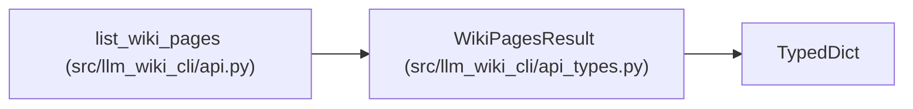

# WikiPagesResult

**Location:** `src/llm_wiki_cli/api_types.py:157`
**Kind:** Class
**Bases:** `TypedDict`
**Module:** [api_types](../modules/api_types.md)

## Description

Top-level ``list_wiki_pages`` payload.

## Attributes

| Name | Type | Default | Description |
|------|------|---------|-------------|
| `wiki_dir` | `str` | *required* | — |
| `counts` | `WikiPageCounts` | *required* | — |
| `pages` | `list[WikiPage]` | *required* | — |

## Methods

*No public methods. Inherits from base classes.*

## Relationships

<!-- Auto-generated relationship summary. Do not edit by hand. -->

### Summary

| Module | Methods | Attributes |
|---|---:|---|
| [api_types](../modules/api_types.md) | 0 | `counts`, `pages`, `wiki_dir` |

### Structure

| Kind | Entity | Module |
|---|---|---|
| Base | `TypedDict` | — |

### References

| Reference | Kind | Source |
|---|---|---|
| `list_wiki_pages` | type_reference | [api](../modules/api.md) |
