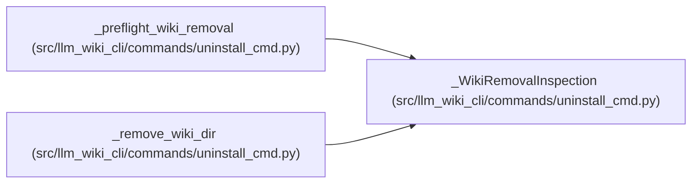

# _WikiRemovalInspection

**Location:** `src/llm_wiki_cli/commands/uninstall_cmd.py:94`
**Kind:** Class
**Bases:** —
**Module:** [uninstall_cmd](../modules/uninstall_cmd.md)

**Decorators:** `@dataclass(frozen=True)`

## Description

Safe root-level evidence for an optional wiki-tree removal.

## Attributes

| Name | Type | Default | Description |
|------|------|---------|-------------|
| `path` | `Path` | *required* | — |
| `present` | `bool` | *required* | — |
| `removable` | `bool` | *required* | — |
| `page_count` | `int` | `0` | — |
| `reason` | `str \| None` | `None` | — |
| `root_identity` | `tuple[int, int, int, int] \| None` | `None` | — |
| `tree_manifest` | `GuardedTreeManifest` | `()` | — |

## Methods

*No public methods. Inherits from base classes.*

## Relationships

<!-- Auto-generated relationship summary. Do not edit by hand. -->

### Summary

| Module | Methods | Attributes |
|---|---:|---|
| [uninstall_cmd](../modules/uninstall_cmd.md) | 0 | `page_count`, `path`, `present`, `reason`, `removable`, `root_identity`, `tree_manifest` |

### References

| Reference | Kind | Source |
|---|---|---|
| `_preflight_wiki_removal` | call | [uninstall_cmd](../modules/uninstall_cmd.md) |
| `_preflight_wiki_removal` | call | [uninstall_cmd](../modules/uninstall_cmd.md) |
| `_preflight_wiki_removal` | call | [uninstall_cmd](../modules/uninstall_cmd.md) |
| `_preflight_wiki_removal` | call | [uninstall_cmd](../modules/uninstall_cmd.md) |
| `_preflight_wiki_removal` | call | [uninstall_cmd](../modules/uninstall_cmd.md) |
| `_preflight_wiki_removal` | call | [uninstall_cmd](../modules/uninstall_cmd.md) |
| `_preflight_wiki_removal` | type_reference | [uninstall_cmd](../modules/uninstall_cmd.md) |
| `_remove_wiki_dir` | type_reference | [uninstall_cmd](../modules/uninstall_cmd.md) |
