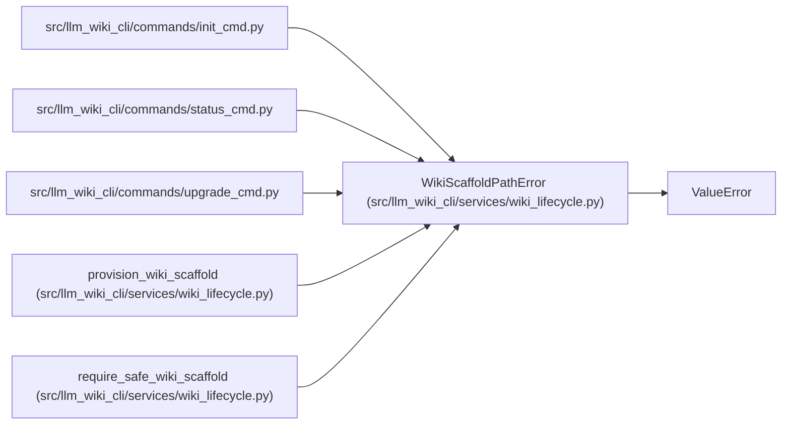

# WikiScaffoldPathError

**Location:** `src/llm_wiki_cli/services/wiki_lifecycle.py:27`
**Kind:** Class
**Bases:** `ValueError`
**Module:** [wiki_lifecycle](../modules/wiki_lifecycle.md)

## Description

Raised when a managed scaffold path is redirected or non-regular.

## Attributes

*No annotated attributes found.*

## Methods

*No public methods. Inherits from base classes.*

## Relationships

<!-- Auto-generated relationship summary. Do not edit by hand. -->

### Summary

| Module | Methods | Attributes |
|---|---:|---|
| [wiki_lifecycle](../modules/wiki_lifecycle.md) | 0 | — |

### Structure

| Kind | Entity | Module |
|---|---|---|
| Base | `ValueError` | — |

### References

| Reference | Kind | Source | Call sites |
|---|---|---|---:|
| `init_cmd` | import | [init_cmd](../modules/init_cmd.md) | — |
| `status_cmd` | import | [status_cmd](../modules/status_cmd.md) | — |
| `upgrade_cmd` | import | [upgrade_cmd](../modules/upgrade_cmd.md) | — |
| `provision_wiki_scaffold` | call | [wiki_lifecycle](../modules/wiki_lifecycle.md) | 1 |
| `require_safe_wiki_scaffold` | call | [wiki_lifecycle](../modules/wiki_lifecycle.md) | 3 |
