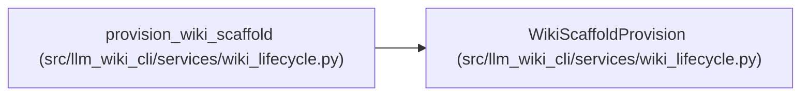

# WikiScaffoldProvision

**Location:** `src/llm_wiki_cli/services/wiki_lifecycle.py:32`
**Kind:** Class
**Bases:** —
**Module:** [wiki_lifecycle](../modules/wiki_lifecycle.md)

**Decorators:** `@dataclass(frozen=True)`

## Description

Additive scaffold entries created by one guarded provisioning pass.

## Attributes

| Name | Type | Default | Description |
|------|------|---------|-------------|
| `directories` | `tuple[str, ...]` | *required* | — |
| `gitkeeps` | `tuple[str, ...]` | *required* | — |
| `files` | `tuple[str, ...]` | *required* | — |

## Methods

*No public methods. Inherits from base classes.*

## Relationships

<!-- Auto-generated relationship summary. Do not edit by hand. -->

### Summary

| Module | Methods | Attributes |
|---|---:|---|
| [wiki_lifecycle](../modules/wiki_lifecycle.md) | 0 | `directories`, `files`, `gitkeeps` |

### References

| Reference | Kind | Source |
|---|---|---|
| `provision_wiki_scaffold` | call | [wiki_lifecycle](../modules/wiki_lifecycle.md) |
| `provision_wiki_scaffold` | type_reference | [wiki_lifecycle](../modules/wiki_lifecycle.md) |
