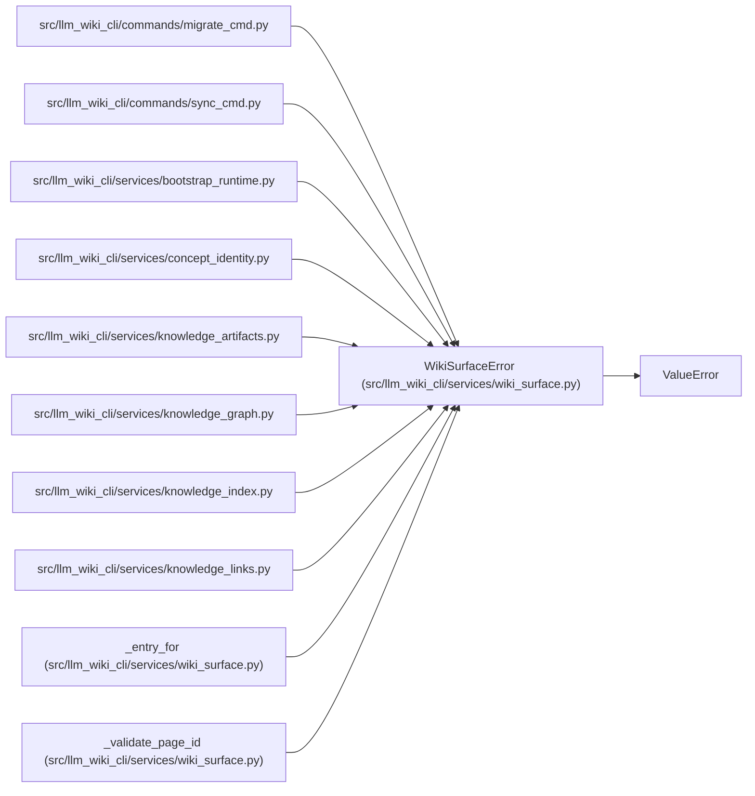

# WikiSurfaceError

**Location:** `src/llm_wiki_cli/services/wiki_surface.py:25`
**Kind:** Class
**Bases:** `ValueError`
**Module:** [wiki_surface](../modules/wiki_surface.md)

## Description

Raised for invalid wiki surface lookups.

## Attributes

*No annotated attributes found.*

## Methods

*No public methods. Inherits from base classes.*

## Relationships

<!-- Auto-generated relationship summary. Do not edit by hand. -->

### Summary

| Module | Methods | Attributes |
|---|---:|---|
| [wiki_surface](../modules/wiki_surface.md) | 0 | — |

### Structure

| Kind | Entity | Module |
|---|---|---|
| Base | `ValueError` | — |

### References

| Reference | Kind | Source |
|---|---|---|
| `migrate_cmd` | import | [migrate_cmd](../modules/migrate_cmd.md) |
| `sync_cmd` | import | [sync_cmd](../modules/sync_cmd.md) |
| `bootstrap_runtime` | import | [bootstrap_runtime](../modules/bootstrap_runtime.md) |
| `concept_identity` | import | [concept_identity](../modules/concept_identity.md) |
| `knowledge_artifacts` | import | [knowledge_artifacts](../modules/knowledge_artifacts.md) |
| `knowledge_graph` | import | [knowledge_graph](../modules/knowledge_graph.md) |
| `knowledge_index` | import | [knowledge_index](../modules/knowledge_index.md) |
| `knowledge_links` | import | [knowledge_links](../modules/knowledge_links.md) |
| `_entry_for` | call | [wiki_surface](../modules/wiki_surface.md) |
| `_validate_page_id` | call | [wiki_surface](../modules/wiki_surface.md) |
| `_validate_page_id` | call | [wiki_surface](../modules/wiki_surface.md) |
| `_validate_page_id` | call | [wiki_surface](../modules/wiki_surface.md) |
