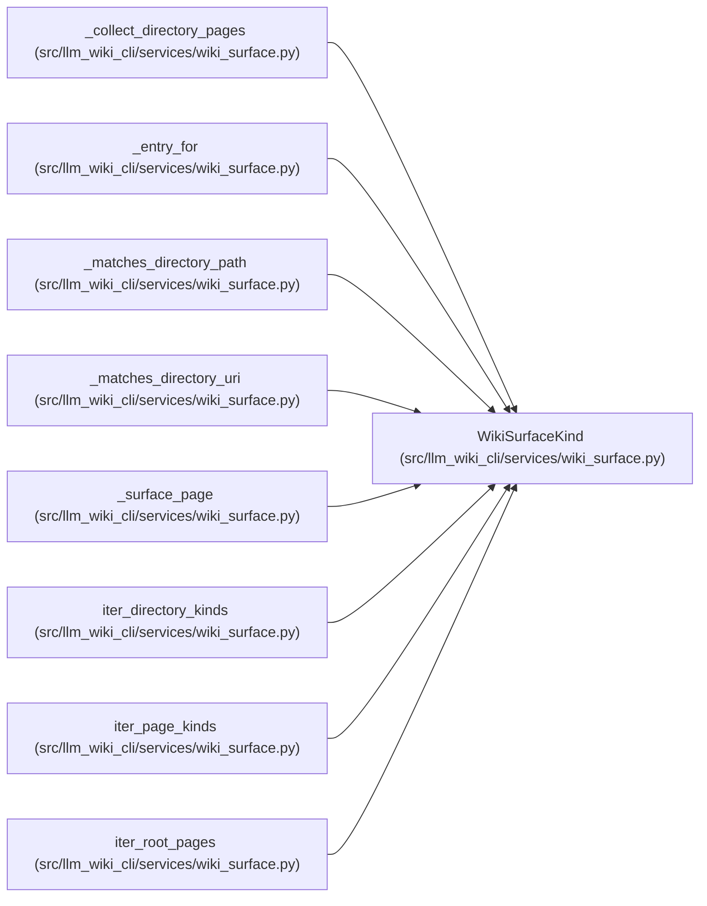

# WikiSurfaceKind

**Location:** `src/llm_wiki_cli/services/wiki_surface.py:62`
**Kind:** Class
**Bases:** —
**Module:** [wiki_surface](../modules/wiki_surface.md)

**Decorators:** `@dataclass(frozen=True)`

## Description

_Auto-generated from `WikiSurfaceKind` in `src/llm_wiki_cli/services/wiki_surface.py`._

## Attributes

| Name | Type | Default | Description |
|------|------|---------|-------------|
| `kind` | `PageKind` | *required* | — |
| `label` | `str` | *required* | — |
| `path_pattern` | `str` | *required* | — |
| `mcp_uri_kind` | `str` | *required* | — |
| `obsidian_mirror_dir` | `Optional[str]` | *required* | — |
| `role` | `SurfaceRole` | *required* | — |

## Methods

| Method | Signature | Decorators | Description |
|--------|-----------|------------|-------------|
| `requires_page_id` | `() -> bool` | `@property` | — |
| `directory` | `() -> Optional[str]` | `@property` | — |

## Relationships

<!-- Auto-generated relationship summary. Do not edit by hand. -->

### Summary

| Module | Methods | Attributes |
|---|---:|---|
| [wiki_surface](../modules/wiki_surface.md) | 2 | `kind`, `label`, `mcp_uri_kind`, `obsidian_mirror_dir`, `path_pattern`, `role` |

### References

| Reference | Kind | Source |
|---|---|---|
| `_collect_directory_pages` | type_reference | [wiki_surface](../modules/wiki_surface.md) |
| `_entry_for` | type_reference | [wiki_surface](../modules/wiki_surface.md) |
| `_matches_directory_path` | type_reference | [wiki_surface](../modules/wiki_surface.md) |
| `_matches_directory_uri` | type_reference | [wiki_surface](../modules/wiki_surface.md) |
| `_surface_page` | type_reference | [wiki_surface](../modules/wiki_surface.md) |
| `iter_directory_kinds` | type_reference | [wiki_surface](../modules/wiki_surface.md) |
| `iter_page_kinds` | type_reference | [wiki_surface](../modules/wiki_surface.md) |
| `iter_root_pages` | type_reference | [wiki_surface](../modules/wiki_surface.md) |
