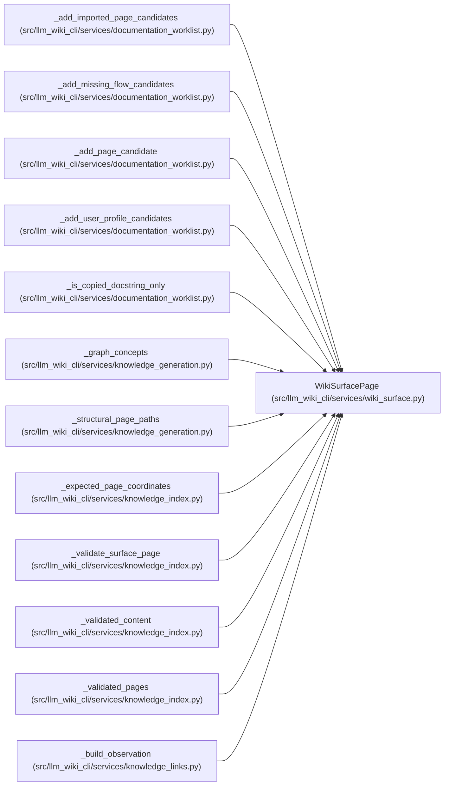

# WikiSurfacePage

**Location:** `src/llm_wiki_cli/services/wiki_surface.py:82`
**Kind:** Class
**Bases:** —
**Module:** [wiki_surface](../modules/wiki_surface.md)

**Decorators:** `@dataclass(frozen=True)`

## Description

_Auto-generated from `WikiSurfacePage` in `src/llm_wiki_cli/services/wiki_surface.py`._

## Attributes

| Name | Type | Default | Description |
|------|------|---------|-------------|
| `kind` | `PageKind` | *required* | — |
| `page_id` | `str` | *required* | — |
| `label` | `str` | *required* | — |
| `path` | `Path` | *required* | — |
| `relative_path` | `str` | *required* | — |
| `mcp_uri` | `str` | *required* | — |
| `obsidian_mirror_dir` | `Optional[str]` | *required* | — |
| `role` | `SurfaceRole` | *required* | — |

## Methods

*No public methods. Inherits from base classes.*

## Relationships

<!-- Auto-generated relationship summary. Do not edit by hand. -->

### Summary

| Module | Methods | Attributes |
|---|---:|---|
| [wiki_surface](../modules/wiki_surface.md) | 0 | `kind`, `label`, `mcp_uri`, `obsidian_mirror_dir`, `page_id`, `path`, `relative_path`, `role` |

### References

| Reference | Kind | Source | Call sites |
|---|---|---|---:|
| `_add_imported_page_candidates` | type_reference | [documentation_worklist](../modules/documentation_worklist.md) | — |
| `_add_missing_flow_candidates` | type_reference | [documentation_worklist](../modules/documentation_worklist.md) | — |
| `_add_page_candidate` | type_reference | [documentation_worklist](../modules/documentation_worklist.md) | — |
| `_add_user_profile_candidates` | type_reference | [documentation_worklist](../modules/documentation_worklist.md) | — |
| `_is_copied_docstring_only` | type_reference | [documentation_worklist](../modules/documentation_worklist.md) | — |
| `_graph_concepts` | type_reference | [knowledge_generation](../modules/knowledge_generation.md) | — |
| `_structural_page_paths` | type_reference | [knowledge_generation](../modules/knowledge_generation.md) | — |
| `_expected_page_coordinates` | type_reference | [knowledge_index](../modules/knowledge_index.md) | — |
| `_validate_surface_page` | type_reference | [knowledge_index](../modules/knowledge_index.md) | — |
| `_validated_content` | type_reference | [knowledge_index](../modules/knowledge_index.md) | — |
| `_validated_pages` | type_reference | [knowledge_index](../modules/knowledge_index.md) | — |
| `_build_observation` | type_reference | [knowledge_links](../modules/knowledge_links.md) | — |

> References: showing 12 of 26 logical references; 14 omitted by the 12-row generated summary limit.
