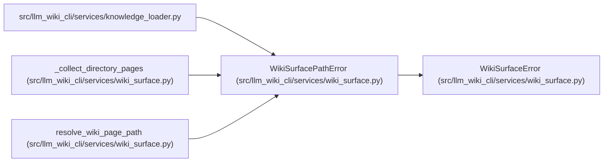

# WikiSurfacePathError

**Location:** `src/llm_wiki_cli/services/wiki_surface.py:32`
**Kind:** Class
**Bases:** `WikiSurfaceError`
**Module:** [wiki_surface](../modules/wiki_surface.md)

## Description

Raised when a canonical page path cannot be read inside its wiki root.

## Attributes

*No annotated attributes found.*

## Methods

| Method | Signature | Decorators | Description |
|--------|-----------|------------|-------------|
| `__init__` | `(message: str, *, relative_path: str) -> None` | — | — |

## Relationships

<!-- Auto-generated relationship summary. Do not edit by hand. -->

### Summary

| Module | Methods | Attributes |
|---|---:|---|
| [wiki_surface](../modules/wiki_surface.md) | 1 | — |

### Structure

| Kind | Entity | Module |
|---|---|---|
| Base | `WikiSurfaceError` | [wiki_surface](../modules/wiki_surface.md) |

### References

| Reference | Kind | Source | Call sites |
|---|---|---|---:|
| `knowledge_loader` | import | [knowledge_loader](../modules/knowledge_loader.md) | — |
| `_collect_directory_pages` | call | [wiki_surface](../modules/wiki_surface.md) | 1 |
| `resolve_wiki_page_path` | call | [wiki_surface](../modules/wiki_surface.md) | 3 |
