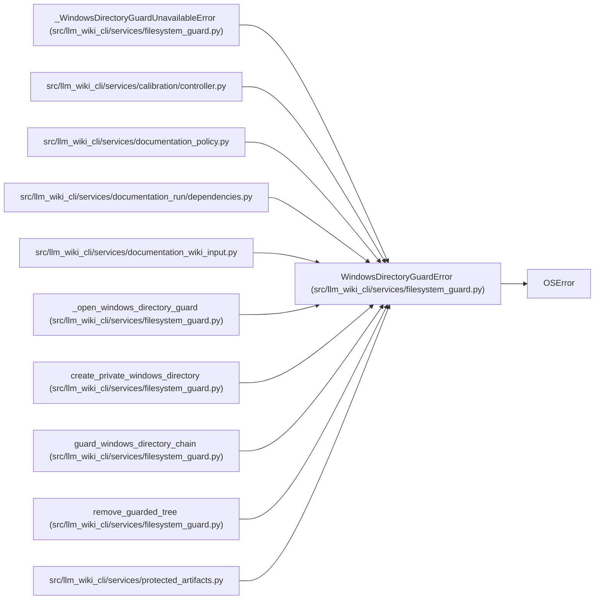

# WindowsDirectoryGuardError

**Location:** `src/llm_wiki_cli/services/filesystem_guard.py:44`
**Kind:** Class
**Bases:** `OSError`
**Module:** [filesystem_guard](../modules/filesystem_guard.md)

## Description

Raised when a Windows directory chain cannot be pinned safely.

## Attributes

*No annotated attributes found.*

## Methods

*No public methods. Inherits from base classes.*

## Relationships

<!-- Auto-generated relationship summary. Do not edit by hand. -->

### Summary

| Module | Methods | Attributes |
|---|---:|---|
| [filesystem_guard](../modules/filesystem_guard.md) | 0 | — |

### Structure

| Kind | Entity | Module |
|---|---|---|
| Base | `OSError` | — |
| Subclass | `_WindowsDirectoryGuardUnavailableError` | [filesystem_guard](../modules/filesystem_guard.md) |

### References

| Reference | Kind | Source | Call sites |
|---|---|---|---:|
| `controller` | import | [controller](../modules/controller.md) | — |
| `documentation_policy` | import | [documentation_policy](../modules/documentation_policy.md) | — |
| `dependencies` | import | [documentation_run_dependencies](../modules/documentation_run_dependencies.md) | — |
| `documentation_wiki_input` | import | [documentation_wiki_input](../modules/documentation_wiki_input.md) | — |
| `_open_windows_directory_guard` | call | [filesystem_guard](../modules/filesystem_guard.md) | 3 |
| `create_private_windows_directory` | call | [filesystem_guard](../modules/filesystem_guard.md) | 3 |
| `guard_windows_directory_chain` | call | [filesystem_guard](../modules/filesystem_guard.md) | 4 |
| `remove_guarded_tree` | call | [filesystem_guard](../modules/filesystem_guard.md) | 5 |
| `protected_artifacts` | import | [protected_artifacts](../modules/protected_artifacts.md) | — |
