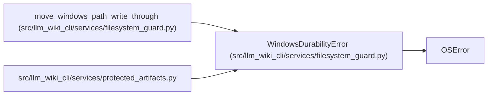

# WindowsDurabilityError

**Location:** `src/llm_wiki_cli/services/filesystem_guard.py:60`
**Kind:** Class
**Bases:** `OSError`
**Module:** [filesystem_guard](../modules/filesystem_guard.md)

## Description

Raised when Windows cannot confirm durable filesystem metadata.

## Attributes

*No annotated attributes found.*

## Methods

*No public methods. Inherits from base classes.*

## Relationships

<!-- Auto-generated relationship summary. Do not edit by hand. -->

### Summary

| Module | Methods | Attributes |
|---|---:|---|
| [filesystem_guard](../modules/filesystem_guard.md) | 0 | — |

### Structure

| Kind | Entity | Module |
|---|---|---|
| Base | `OSError` | — |

### References

| Reference | Kind | Source |
|---|---|---|
| `move_windows_path_write_through` | call | [filesystem_guard](../modules/filesystem_guard.md) |
| `move_windows_path_write_through` | call | [filesystem_guard](../modules/filesystem_guard.md) |
| `protected_artifacts` | import | [protected_artifacts](../modules/protected_artifacts.md) |
