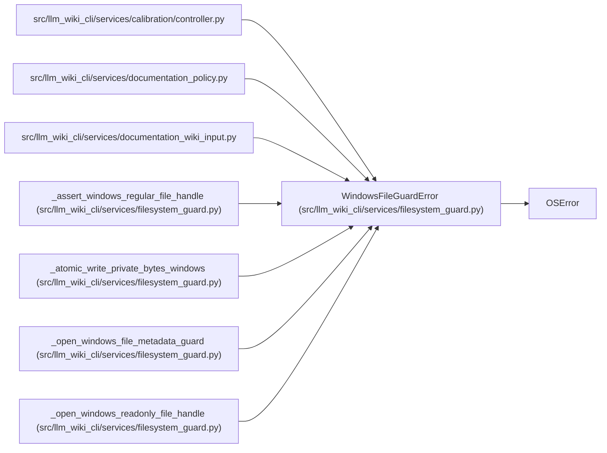

# WindowsFileGuardError

**Location:** `src/llm_wiki_cli/services/filesystem_guard.py:47`
**Kind:** Class
**Bases:** `OSError`
**Module:** [filesystem_guard](../modules/filesystem_guard.md)

## Description

Raised when a Windows input file cannot be opened without redirection.

## Attributes

*No annotated attributes found.*

## Methods

*No public methods. Inherits from base classes.*

## Relationships

<!-- Auto-generated relationship summary. Do not edit by hand. -->

### Summary

| Module | Methods | Attributes |
|---|---:|---|
| [filesystem_guard](../modules/filesystem_guard.md) | 0 | — |

### Structure

| Kind | Entity | Module |
|---|---|---|
| Base | `OSError` | — |

### References

| Reference | Kind | Source |
|---|---|---|
| `controller` | import | [controller](../modules/controller.md) |
| `documentation_policy` | import | [documentation_policy](../modules/documentation_policy.md) |
| `documentation_wiki_input` | import | [documentation_wiki_input](../modules/documentation_wiki_input.md) |
| `_assert_windows_regular_file_handle` | call | [filesystem_guard](../modules/filesystem_guard.md) |
| `_assert_windows_regular_file_handle` | call | [filesystem_guard](../modules/filesystem_guard.md) |
| `_atomic_write_private_bytes_windows` | call | [filesystem_guard](../modules/filesystem_guard.md) |
| `_open_windows_file_metadata_guard` | call | [filesystem_guard](../modules/filesystem_guard.md) |
| `_open_windows_readonly_file_handle` | call | [filesystem_guard](../modules/filesystem_guard.md) |
| `_open_windows_readonly_file_handle` | call | [filesystem_guard](../modules/filesystem_guard.md) |
| `_open_windows_readonly_file_handle` | call | [filesystem_guard](../modules/filesystem_guard.md) |
| `_open_windows_readonly_file_handle` | call | [filesystem_guard](../modules/filesystem_guard.md) |
| `_open_windows_readonly_file_handle` | call | [filesystem_guard](../modules/filesystem_guard.md) |
