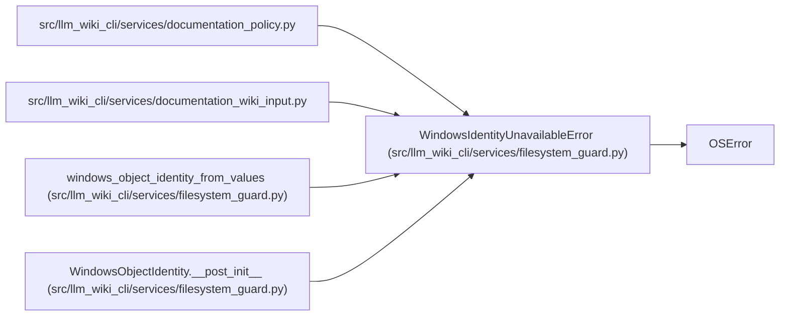

# WindowsIdentityUnavailableError

**Location:** `src/llm_wiki_cli/services/filesystem_guard.py:64`
**Kind:** Class
**Bases:** `OSError`
**Module:** [filesystem_guard](../modules/filesystem_guard.md)

## Description

Raised when Windows cannot expose a stable filesystem object identity.

## Attributes

*No annotated attributes found.*

## Methods

*No public methods. Inherits from base classes.*

## Relationships

<!-- Auto-generated relationship summary. Do not edit by hand. -->

### Summary

| Module | Methods | Attributes |
|---|---:|---|
| [filesystem_guard](../modules/filesystem_guard.md) | 0 | — |

### Structure

| Kind | Entity | Module |
|---|---|---|
| Base | `OSError` | — |

### References

| Reference | Kind | Source |
|---|---|---|
| `documentation_policy` | import | [documentation_policy](../modules/documentation_policy.md) |
| `documentation_wiki_input` | import | [documentation_wiki_input](../modules/documentation_wiki_input.md) |
| `windows_object_identity_from_values` | call | [filesystem_guard](../modules/filesystem_guard.md) |
| `WindowsObjectIdentity.__post_init__` | call | [filesystem_guard](../modules/filesystem_guard.md) |
