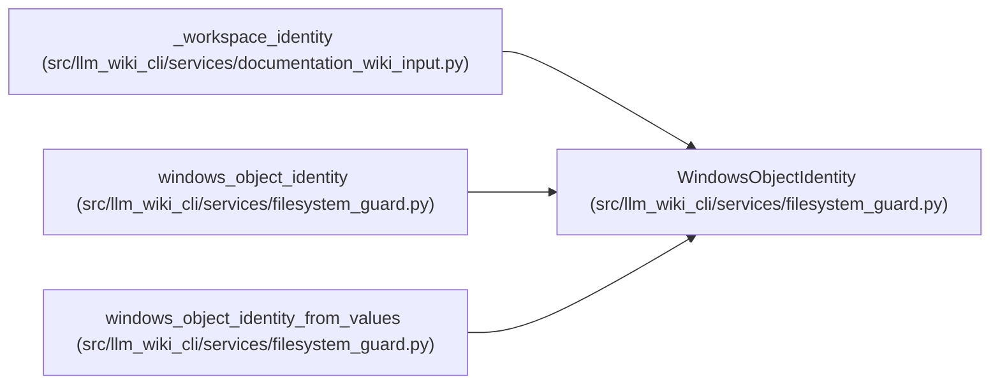

# WindowsObjectIdentity

**Location:** `src/llm_wiki_cli/services/filesystem_guard.py:69`
**Kind:** Class
**Bases:** —
**Module:** [filesystem_guard](../modules/filesystem_guard.md)

**Decorators:** `@dataclass(frozen=True)`

## Description

Immutable Windows device and file identifier exposed by a real stat call.

## Attributes

| Name | Type | Default | Description |
|------|------|---------|-------------|
| `device` | `int` | *required* | — |
| `file_id` | `int` | *required* | — |

## Methods

| Method | Signature | Decorators | Description |
|--------|-----------|------------|-------------|
| `__post_init__` | `() -> None` | — | — |

## Relationships

<!-- Auto-generated relationship summary. Do not edit by hand. -->

### Summary

| Module | Methods | Attributes |
|---|---:|---|
| [filesystem_guard](../modules/filesystem_guard.md) | 1 | `device`, `file_id` |

### References

| Reference | Kind | Source | Call sites |
|---|---|---|---:|
| `_workspace_identity` | type_reference | [documentation_wiki_input](../modules/documentation_wiki_input.md) | — |
| `windows_object_identity` | type_reference | [filesystem_guard](../modules/filesystem_guard.md) | — |
| `windows_object_identity_from_values` | call | [filesystem_guard](../modules/filesystem_guard.md) | 1 |
| `windows_object_identity_from_values` | type_reference | [filesystem_guard](../modules/filesystem_guard.md) | — |
