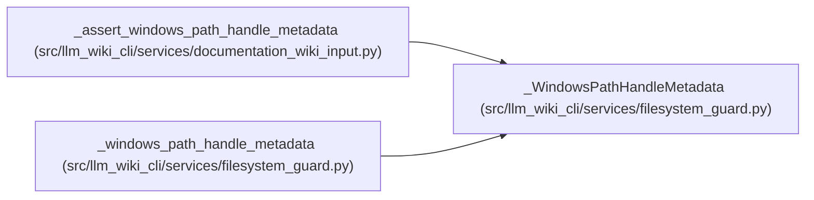

# _WindowsPathHandleMetadata

**Location:** `src/llm_wiki_cli/services/filesystem_guard.py:83`
**Kind:** Class
**Bases:** —
**Module:** [filesystem_guard](../modules/filesystem_guard.md)

**Decorators:** `@dataclass(frozen=True)`

## Description

Metadata with consistent semantics across Windows path and handle stats.

## Attributes

| Name | Type | Default | Description |
|------|------|---------|-------------|
| `size` | `int` | *required* | — |
| `mtime_ns` | `int` | *required* | — |

## Methods

*No public methods. Inherits from base classes.*

## Relationships

<!-- Auto-generated relationship summary. Do not edit by hand. -->

### Summary

| Module | Methods | Attributes |
|---|---:|---|
| [filesystem_guard](../modules/filesystem_guard.md) | 0 | `mtime_ns`, `size` |

### References

| Reference | Kind | Source | Call sites |
|---|---|---|---:|
| `_assert_windows_path_handle_metadata` | type_reference | [documentation_wiki_input](../modules/documentation_wiki_input.md) | — |
| `_windows_path_handle_metadata` | call | [filesystem_guard](../modules/filesystem_guard.md) | 1 |
| `_windows_path_handle_metadata` | type_reference | [filesystem_guard](../modules/filesystem_guard.md) | — |
