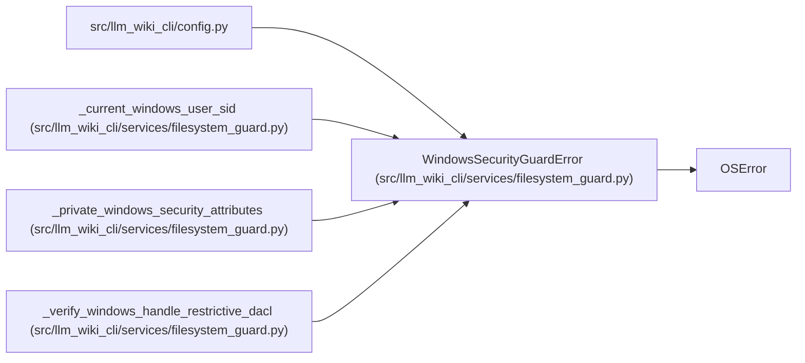

# WindowsSecurityGuardError

**Location:** `src/llm_wiki_cli/services/filesystem_guard.py:56`
**Kind:** Class
**Bases:** `OSError`
**Module:** [filesystem_guard](../modules/filesystem_guard.md)

## Description

Raised when a Windows object lacks the required restrictive DACL.

## Attributes

*No annotated attributes found.*

## Methods

*No public methods. Inherits from base classes.*

## Relationships

<!-- Auto-generated relationship summary. Do not edit by hand. -->

### Summary

| Module | Methods | Attributes |
|---|---:|---|
| [filesystem_guard](../modules/filesystem_guard.md) | 0 | — |

### Structure

| Kind | Entity | Module |
|---|---|---|
| Base | `OSError` | — |

### References

| Reference | Kind | Source |
|---|---|---|
| `config` | import | [config](../modules/config.md) |
| `_current_windows_user_sid` | call | [filesystem_guard](../modules/filesystem_guard.md) |
| `_current_windows_user_sid` | call | [filesystem_guard](../modules/filesystem_guard.md) |
| `_current_windows_user_sid` | call | [filesystem_guard](../modules/filesystem_guard.md) |
| `_private_windows_security_attributes` | call | [filesystem_guard](../modules/filesystem_guard.md) |
| `_verify_windows_handle_restrictive_dacl` | call | [filesystem_guard](../modules/filesystem_guard.md) |
| `_verify_windows_handle_restrictive_dacl` | call | [filesystem_guard](../modules/filesystem_guard.md) |
| `_verify_windows_handle_restrictive_dacl` | call | [filesystem_guard](../modules/filesystem_guard.md) |
| `_verify_windows_handle_restrictive_dacl` | call | [filesystem_guard](../modules/filesystem_guard.md) |
| `_verify_windows_handle_restrictive_dacl` | call | [filesystem_guard](../modules/filesystem_guard.md) |
| `_verify_windows_handle_restrictive_dacl` | call | [filesystem_guard](../modules/filesystem_guard.md) |
| `_verify_windows_handle_restrictive_dacl` | call | [filesystem_guard](../modules/filesystem_guard.md) |
