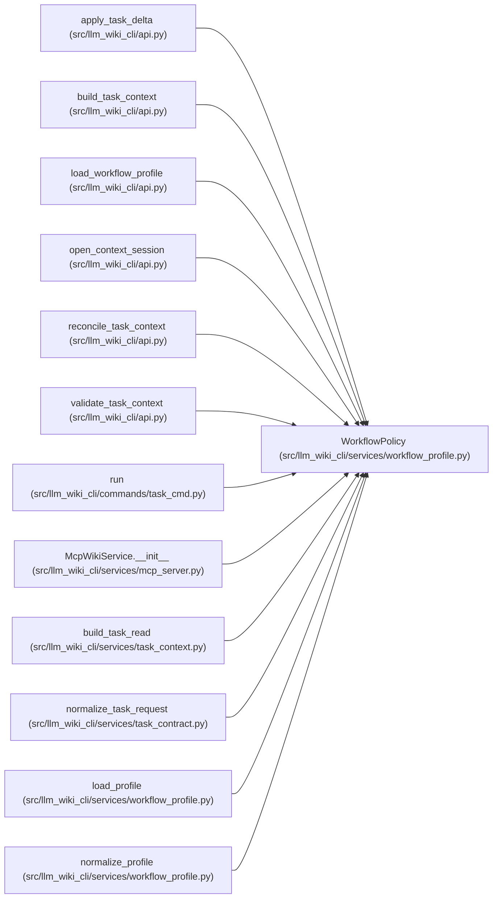

# WorkflowPolicy

**Location:** `src/llm_wiki_cli/services/workflow_profile.py:92`
**Kind:** Class
**Bases:** —
**Module:** [workflow_profile](../modules/workflow_profile.md)

**Decorators:** `@dataclass(frozen=True)`

## Description

Trusted host ceilings for read scope, output size, captured inputs, graph results and follow-up work. Profile and per-call settings may narrow these ceilings; an explicit request cannot silently expand them.

## Attributes

| Name | Type | Default | Description |
|------|------|---------|-------------|
| `read_scope` | `str` | `'selected'` | — |
| `budget_tokens` | `int` | `32000` | — |
| `max_files` | `int` | `128` | — |
| `max_source_bytes` | `int` | `16777216` | — |
| `max_wiki_bytes` | `int` | `16777216` | — |
| `max_read_rounds` | `int` | `8` | — |
| `max_graph_items` | `int` | `100` | — |
| `max_followups` | `int` | `8` | — |
| `max_retries` | `int` | `1` | — |

## Methods

| Method | Signature | Decorators | Description |
|--------|-----------|------------|-------------|
| `__post_init__` | `()` | — | — |
| `to_payload` | `() -> dict[str, Any]` | — | — |

## Relationships

<!-- Auto-generated relationship summary. Do not edit by hand. -->

### Summary

| Module | Methods | Attributes |
|---|---:|---|
| [workflow_profile](../modules/workflow_profile.md) | 2 | `budget_tokens`, `max_files`, `max_followups`, `max_graph_items`, `max_read_rounds`, `max_retries`, `max_source_bytes`, `max_wiki_bytes`, `read_scope` |

### References

| Reference | Kind | Source | Call sites |
|---|---|---|---:|
| `apply_task_delta` | type_reference | [api](../modules/api.md) | — |
| `build_task_context` | type_reference | [api](../modules/api.md) | — |
| `load_workflow_profile` | type_reference | [api](../modules/api.md) | — |
| `open_context_session` | type_reference | [api](../modules/api.md) | — |
| `reconcile_task_context` | type_reference | [api](../modules/api.md) | — |
| `validate_task_context` | type_reference | [api](../modules/api.md) | — |
| `run` | call | [task_cmd](../modules/task_cmd.md) | 1 |
| `McpWikiService.__init__` | type_reference | [mcp_server](../modules/mcp_server.md) | — |
| `build_task_read` | type_reference | [task_context](../modules/task_context.md) | — |
| `normalize_task_request` | type_reference | [task_contract](../modules/task_contract.md) | — |
| `load_profile` | type_reference | [workflow_profile](../modules/workflow_profile.md) | — |
| `normalize_profile` | call | [workflow_profile](../modules/workflow_profile.md) | 1 |

> References: showing 12 of 13 logical references; 1 omitted by the 12-row generated summary limit.
