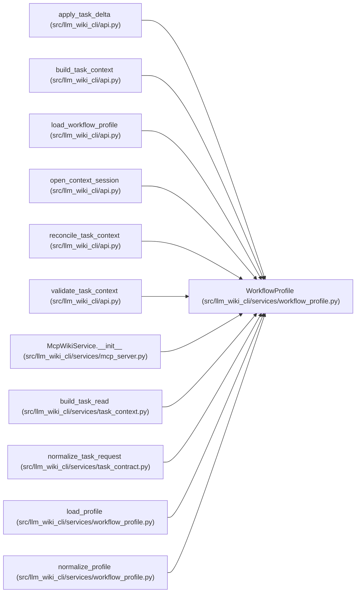

# WorkflowProfile

**Location:** `src/llm_wiki_cli/services/workflow_profile.py:113`
**Kind:** Class
**Bases:** —
**Module:** [workflow_profile](../modules/workflow_profile.md)

**Decorators:** `@dataclass(frozen=True)`

## Description

An immutable canonical profile with detached settings and a content identity. Activation is explicit. Loading a profile does not change source, wiki, agent configuration, helper state or permissions.

## Attributes

| Name | Type | Default | Description |
|------|------|---------|-------------|
| `_bytes` | `bytes` | *required* | — |

## Methods

| Method | Signature | Decorators | Description |
|--------|-----------|------------|-------------|
| `__post_init__` | `()` | — | — |
| `profile_id` | `() -> str` | `@property` | — |
| `to_payload` | `() -> dict[str, Any]` | — | — |
| `settings` | `() -> dict[str, Any]` | `@property` | — |

## Relationships

<!-- Auto-generated relationship summary. Do not edit by hand. -->

### Summary

| Module | Methods | Attributes |
|---|---:|---|
| [workflow_profile](../modules/workflow_profile.md) | 4 | `_bytes` |

### References

| Reference | Kind | Source | Call sites |
|---|---|---|---:|
| `apply_task_delta` | type_reference | [api](../modules/api.md) | — |
| `build_task_context` | type_reference | [api](../modules/api.md) | — |
| `load_workflow_profile` | type_reference | [api](../modules/api.md) | — |
| `open_context_session` | type_reference | [api](../modules/api.md) | — |
| `reconcile_task_context` | type_reference | [api](../modules/api.md) | — |
| `validate_task_context` | type_reference | [api](../modules/api.md) | — |
| `McpWikiService.__init__` | type_reference | [mcp_server](../modules/mcp_server.md) | — |
| `build_task_read` | type_reference | [task_context](../modules/task_context.md) | — |
| `normalize_task_request` | type_reference | [task_contract](../modules/task_contract.md) | — |
| `load_profile` | type_reference | [workflow_profile](../modules/workflow_profile.md) | — |
| `normalize_profile` | call | [workflow_profile](../modules/workflow_profile.md) | 1 |
| `normalize_profile` | type_reference | [workflow_profile](../modules/workflow_profile.md) | — |