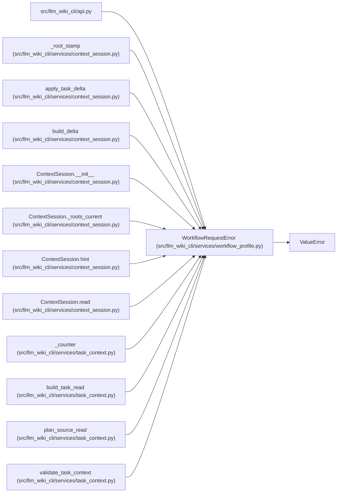

# WorkflowRequestError

**Location:** `src/llm_wiki_cli/services/workflow_profile.py:28`
**Kind:** Class
**Bases:** `ValueError`
**Module:** [workflow_profile](../modules/workflow_profile.md)

## Description

Identifies an invalid workflow contract field before workspace reads. Public adapters translate the error through their established invalid-request representation.

## Attributes

*No annotated attributes found.*

## Methods

| Method | Signature | Decorators | Description |
|--------|-----------|------------|-------------|
| `__init__` | `(field: str, message: str)` | — | — |

## Relationships

<!-- Auto-generated relationship summary. Do not edit by hand. -->

### Summary

| Module | Methods | Attributes |
|---|---:|---|
| [workflow_profile](../modules/workflow_profile.md) | 1 | — |

### Structure

| Kind | Entity | Module |
|---|---|---|
| Base | `ValueError` | — |

### References

| Reference | Kind | Source | Call sites |
|---|---|---|---:|
| `api` | import | [api](../modules/api.md) | — |
| `_root_stamp` | call | [context_session](../modules/context_session.md) | 2 |
| `apply_task_delta` | call | [context_session](../modules/context_session.md) | 4 |
| `build_delta` | call | [context_session](../modules/context_session.md) | 1 |
| `ContextSession.__init__` | call | [context_session](../modules/context_session.md) | 1 |
| `ContextSession._roots_current` | call | [context_session](../modules/context_session.md) | 2 |
| `ContextSession.hint` | call | [context_session](../modules/context_session.md) | 1 |
| `ContextSession.read` | call | [context_session](../modules/context_session.md) | 6 |
| `_counter` | call | [task_context](../modules/task_context.md) | 4 |
| `build_task_read` | call | [task_context](../modules/task_context.md) | 1 |
| `plan_source_read` | call | [task_context](../modules/task_context.md) | 2 |
| `validate_task_context` | call | [task_context](../modules/task_context.md) | 1 |

> References: showing 12 of 23 logical references; 11 omitted by the 12-row generated summary limit.
