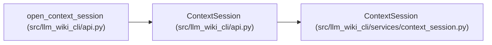

# ContextSession

**Location:** `src/llm_wiki_cli/api.py:1359`
**Kind:** Class
**Bases:** `_ContextSession`
**Module:** [api](../modules/api.md)

## Description

Public session facade with the established API error contract. Each instance binds to one workspace and policy, serializes reads, and releases disposable state on close. Event hints never replace authoritative input validation.

## Attributes

*No annotated attributes found.*

## Methods

| Method | Signature | Decorators | Description |
|--------|-----------|------------|-------------|
| `read` | `(request: Mapping[str, Any], *, if_result_id: str \| None = None, delta: bool = False, reuse: bool = True, cancelled: Callable[[], bool] \| None = None) -> SessionReply` | `@_api_boundary` | — |
| `hint` | `(*, unsaved_buffers: bool = False) -> None` | `@_api_boundary` | — |
| `close` | `() -> None` | `@_api_boundary` | — |

## Relationships

<!-- Auto-generated relationship summary. Do not edit by hand. -->

### Summary

| Module | Methods | Attributes |
|---|---:|---|
| [api](../modules/api.md) | 3 | — |

### Structure

| Kind | Entity | Module |
|---|---|---|
| Base | `ContextSession` | [context_session](../modules/context_session.md) |

### References

| Reference | Kind | Source | Call sites |
|---|---|---|---:|
| `open_context_session` | call | [api](../modules/api.md) | 1 |
| `open_context_session` | type_reference | [api](../modules/api.md) | — |
