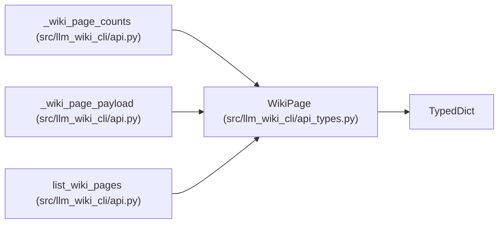

# WikiPage

**Location:** `src/llm_wiki_cli/api_types.py:137`
**Kind:** Class
**Bases:** `TypedDict`
**Module:** [api_types](../modules/api_types.md)

## Description

One registry-backed wiki page.

## Attributes

| Name | Type | Default | Description |
|------|------|---------|-------------|
| `kind` | `str` | *required* | — |
| `id` | `str` | *required* | — |
| `label` | `str` | *required* | — |
| `canonical_path` | `str` | *required* | — |
| `mcp_uri` | `str` | *required* | — |
| `role` | `str` | *required* | — |
| `obsidian_mirror_dir` | `str \| None` | *required* | — |

## Methods

*No public methods. Inherits from base classes.*

## Relationships

<!-- Auto-generated relationship summary. Do not edit by hand. -->

### Summary

| Module | Methods | Attributes |
|---|---:|---|
| [api_types](../modules/api_types.md) | 0 | `canonical_path`, `id`, `kind`, `label`, `mcp_uri`, `obsidian_mirror_dir`, `role` |

### Structure

| Kind | Entity | Module |
|---|---|---|
| Base | `TypedDict` | — |

### References

| Reference | Kind | Source | Call sites |
|---|---|---|---:|
| `_wiki_page_counts` | type_reference | [api](../modules/api.md) | — |
| `_wiki_page_payload` | type_reference | [api](../modules/api.md) | — |
| `list_wiki_pages` | type_reference | [api](../modules/api.md) | — |
