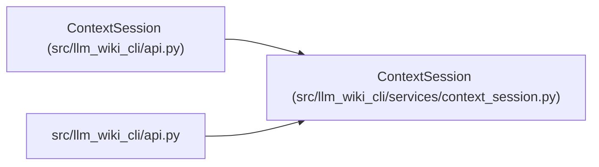

# ContextSession

**Location:** `src/llm_wiki_cli/services/context_session.py:181`
**Kind:** Class
**Bases:** —
**Module:** [context_session](../modules/context_session.md)

## Description

The bounded session implementation owns capture and rendering reuse, input revalidation, expiry and eviction. Caller mutations cannot change retained results. Missing validation capabilities fall back to cold reads, and unsaved buffers require save or defer handling.

## Attributes

*No annotated attributes found.*

## Methods

| Method | Signature | Decorators | Description |
|--------|-----------|------------|-------------|
| `__init__` | `(*, src_dir = '.', wiki_dir = DEFAULT_WIKI_DIR, profile = None, policy = None, counter = None, source_selection = None, helper_cache_dir = None, allow_external_src = False, max_entries = 8, max_bytes = 16777216, ttl_seconds: float = 300)` | — | — |
| `_roots_current` | `()` | — | — |
| `_environment` | `()` | — | — |
| `_clear` | `()` | — | — |
| `_drop` | `(key)` | — | — |
| `_owns` | `(entry)` | — | — |
| `_validate` | `(entry, environment, request, profile, counter, *, cold = False)` | — | — |
| `_build` | `(request, *, cancelled, shared = None)` | — | — |
| `_compatible_capture` | `(normalized, profile, environment)` | — | — |
| `read` | `(request, *, if_result_id = None, delta = False, reuse = True, cancelled: Callable[[], bool] \| None = None) -> SessionReply` | — | — |
| `hint` | `(*, unsaved_buffers = False)` | — | — |
| `close` | `()` | — | — |
| `__enter__` | `()` | — | — |
| `__exit__` | `(*_)` | — | — |

## Relationships

<!-- Auto-generated relationship summary. Do not edit by hand. -->

### Summary

| Module | Methods | Attributes |
|---|---:|---|
| [context_session](../modules/context_session.md) | 14 | — |

### Structure

| Kind | Entity | Module |
|---|---|---|
| Subclass | `ContextSession` | [api](../modules/api.md) |

### References

| Reference | Kind | Source | Call sites |
|---|---|---|---:|
| `api` | import | [api](../modules/api.md) | — |
