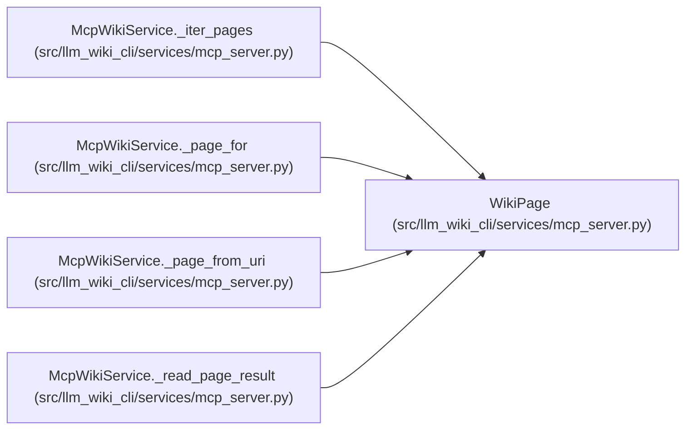

# WikiPage

**Location:** `src/llm_wiki_cli/services/mcp_server.py:161`
**Kind:** Class
**Bases:** —
**Module:** [mcp_server](../modules/mcp_server.md)

**Decorators:** `@dataclass`

## Description

_Auto-generated from `WikiPage` in `src/llm_wiki_cli/services/mcp_server.py`._

## Attributes

| Name | Type | Default | Description |
|------|------|---------|-------------|
| `kind` | `str` | *required* | — |
| `page_id` | `str` | *required* | — |
| `path` | `Path` | *required* | — |
| `uri` | `str` | *required* | — |

## Methods

*No public methods. Inherits from base classes.*

## Relationships

<!-- Auto-generated relationship summary. Do not edit by hand. -->

### Summary

| Module | Methods | Attributes |
|---|---:|---|
| [mcp_server](../modules/mcp_server.md) | 0 | `kind`, `page_id`, `path`, `uri` |

### References

| Reference | Kind | Source |
|---|---|---|
| `McpWikiService._iter_pages` | call | [mcp_server](../modules/mcp_server.md) |
| `McpWikiService._page_for` | call | [mcp_server](../modules/mcp_server.md) |
| `McpWikiService._page_for` | type_reference | [mcp_server](../modules/mcp_server.md) |
| `McpWikiService._page_from_uri` | call | [mcp_server](../modules/mcp_server.md) |
| `McpWikiService._page_from_uri` | type_reference | [mcp_server](../modules/mcp_server.md) |
| `McpWikiService._read_page_result` | type_reference | [mcp_server](../modules/mcp_server.md) |
