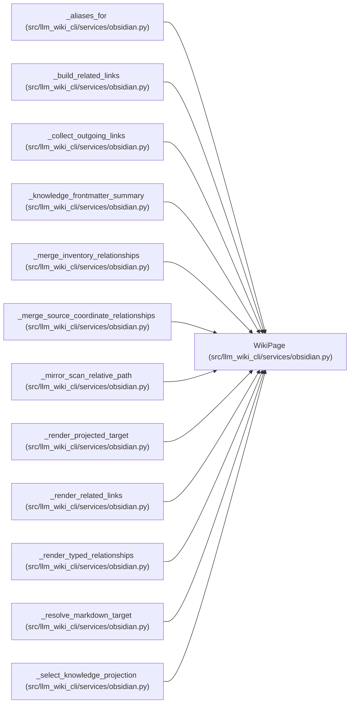

# WikiPage

**Location:** `src/llm_wiki_cli/services/obsidian.py:153`
**Kind:** Class
**Bases:** —
**Module:** [obsidian](../modules/obsidian.md)

**Decorators:** `@dataclass(frozen=True)`

## Description

_Auto-generated from `WikiPage` in `src/llm_wiki_cli/services/obsidian.py`._

## Attributes

| Name | Type | Default | Description |
|------|------|---------|-------------|
| `kind` | `str` | *required* | — |
| `page_id` | `str` | *required* | — |
| `title` | `str` | *required* | — |
| `canonical_path` | `Path` | *required* | — |
| `canonical_rel` | `str` | *required* | — |
| `mirror_rel` | `str` | *required* | — |
| `source_path` | `str \| None` | `None` | — |
| `source_line` | `int \| None` | `None` | — |

## Methods

*No public methods. Inherits from base classes.*

## Relationships

<!-- Auto-generated relationship summary. Do not edit by hand. -->

### Summary

| Module | Methods | Attributes |
|---|---:|---|
| [obsidian](../modules/obsidian.md) | 0 | `canonical_path`, `canonical_rel`, `kind`, `mirror_rel`, `page_id`, `source_line`, `source_path`, `title` |

### References

| Reference | Kind | Source |
|---|---|---|
| `_aliases_for` | type_reference | [obsidian](../modules/obsidian.md) |
| `_build_related_links` | type_reference | [obsidian](../modules/obsidian.md) |
| `_collect_outgoing_links` | type_reference | [obsidian](../modules/obsidian.md) |
| `_knowledge_frontmatter_summary` | type_reference | [obsidian](../modules/obsidian.md) |
| `_merge_inventory_relationships` | type_reference | [obsidian](../modules/obsidian.md) |
| `_merge_source_coordinate_relationships` | type_reference | [obsidian](../modules/obsidian.md) |
| `_mirror_scan_relative_path` | type_reference | [obsidian](../modules/obsidian.md) |
| `_render_projected_target` | type_reference | [obsidian](../modules/obsidian.md) |
| `_render_related_links` | type_reference | [obsidian](../modules/obsidian.md) |
| `_render_typed_relationships` | type_reference | [obsidian](../modules/obsidian.md) |
| `_resolve_markdown_target` | type_reference | [obsidian](../modules/obsidian.md) |
| `_select_knowledge_projection` | type_reference | [obsidian](../modules/obsidian.md) |
