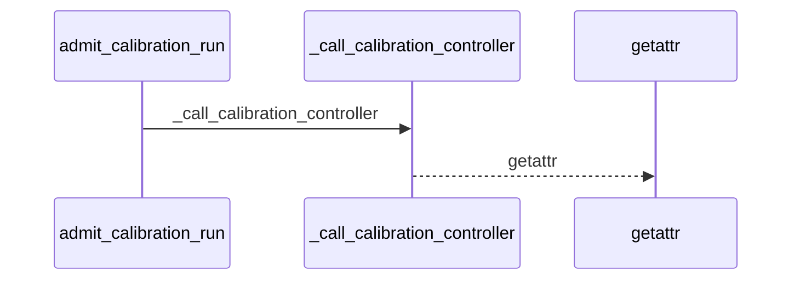
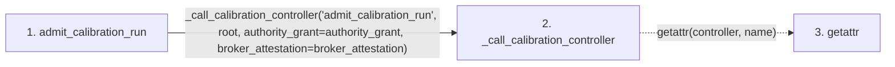

# admit_calibration_run

**Entry point:** `admit_calibration_run` (`api`)
**Source:** [api](../modules/api.md)
**Modules touched:** [api](../modules/api.md)

## Call sequence

<!-- Auto-generated from static call edges. Dashed arrows are external or unresolved calls. Reviewed runtime conditions and side effects belong in Behavior. -->

## Data flow

<!-- Auto-generated static analysis. Treat values and boundaries as best-effort hints, not runtime proof. -->

### Step data

| Step | Inputs | Reads | Writes | Returns |
|---|---|---|---|---|
| `admit_calibration_run` | `root: str \| Path`, `authority_grant: Mapping[str, Any]`, `broker_attestation: Mapping[str, Any] \| None` | - | - | `_call_calibration_controller(...)` |
| `_call_calibration_controller` | `name: str`, `args: Any`, `kwargs: Any` | - | - | `...` |
| `getattr` | - | - | - | - |

### Call data

| From | To | Line | Call |
|---|---|---:|---|
| admit_calibration_run | _call_calibration_controller | 1411 | `_call_calibration_controller('admit_calibration_run', root, authority_grant=authority_grant, broker_attestation=broker_attestation)` |
| _call_calibration_controller | getattr | 1382 | `getattr(controller, name)` |

### Boundary effects

*No boundary effects detected.*

### Static analysis gaps

| Kind | Step | Target | Line |
|---|---|---|---:|
| unresolved_call | `_call_calibration_controller` | `getattr` | 1382 |

## Behavior

This flow starts at `admit_calibration_run` and is classified as `api`. The generated call and data-flow sections are bounded static projections; runtime conditions and side effects require source-level confirmation.
