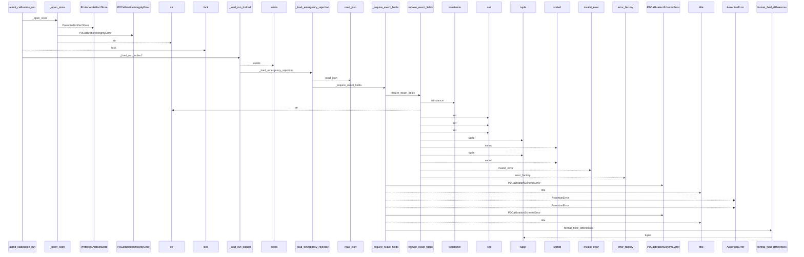
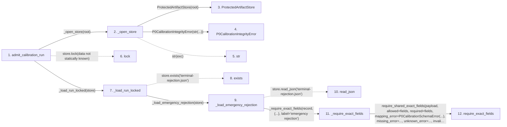

# admit_calibration_run

**Entry point:** `admit_calibration_run` (`api`)
**Source:** [controller](../modules/controller.md)
**Modules touched:** [broker](../modules/broker.md), [calibration_contracts](../modules/calibration_contracts.md), [controller](../modules/controller.md), [documentation_policy](../modules/documentation_policy.md), and 4 more

**Complete modules touched:**

- [broker](../modules/broker.md)
- [calibration_contracts](../modules/calibration_contracts.md)
- [controller](../modules/controller.md)
- [documentation_policy](../modules/documentation_policy.md)
- [filesystem_guard](../modules/filesystem_guard.md)
- [host_broker](../modules/host_broker.md)
- [protected_artifacts](../modules/protected_artifacts.md)
- [validation](../modules/validation.md)

## Call sequence

<!-- Auto-generated from static call edges. Dashed arrows are external or unresolved calls. Reviewed runtime conditions and side effects belong in Behavior. -->

> Call sequence diagram shows 30 of 1681 interactions; 1651 omitted to keep the visualization within the 30-interaction and generated-diagram limits.

> Trace truncated at the depth limit; deeper calls are omitted.

## Data flow

<!-- Auto-generated static analysis. Treat values and boundaries as best-effort hints, not runtime proof. -->

### Step data

| Step | Inputs | Reads | Writes | Returns |
|---|---|---|---|---|
| `admit_calibration_run` | `root: str \| Path`, `authority_grant: Mapping[str, Any]`, `broker_attestation: Mapping[str, Any] \| None` | `timezone`, `P0CalibrationError` | - | `_terminal_transition_locked(...)`, `_terminal_transition_locked(...)`, `run`, `_terminal_transition_locked(...)`, `_terminal_transition_locked(...)`, `_terminal_transition_locked(...)`, `_terminal_transition_locked(...)`, `_terminal_transition_locked(...)` |
| `_open_store` | `root: str \| Path` | `ProtectedArtifactError` | - | `ProtectedArtifactStore(...)` |
| `ProtectedArtifactStore` | - | - | - | - |
| `P0CalibrationIntegrityError` | - | - | - | - |
| `str` | - | - | - | - |
| `lock` | - | - | - | - |
| `_load_run_locked` | `store: ProtectedArtifactStore` | `P0CalibrationRecoveryError`, `P0CalibrationError`, `ProtectedArtifactError`, `ProtectedArtifactError`, `CALIBRATION_TERMINAL_STATES`, `P0CalibrationError`, `ProtectedArtifactError` | - | `_load_emergency_rejection(...)`, `_block_ambiguous_recovery(...)`, `_persist_emergency_rejection(...)`, `_terminal_transition_locked(...)`, `run`, `_persist_emergency_rejection(...)` |
| `exists` | - | - | - | - |
| `_load_emergency_rejection` | `store: ProtectedArtifactStore` | `P0_CALIBRATION_EMERGENCY_REJECTION_SCHEMA_VERSION`, `P0_CALIBRATION_DECISION_SCOPE` | - | `run` |
| `read_json` | - | - | - | - |
| `_require_exact_fields` | `payload: Mapping[str, Any]`, `fields: set[str]`, `label: str` | - | - | `require_shared_exact_fields(...)` |
| `require_exact_fields` | `value: object`, `allowed: Iterable[str]`, `required: Iterable[str]`, `mapping_error: Exception`, `missing_error: _ErrorFactory`, `unknown_error: _ErrorFactory`, `invalid_error: Callable[[tuple[str, ...], tuple[str, ...]], Exception] \| None`, `stringify_keys: bool` | `Mapping` | - | - |

### Call data

| From | To | Line | Call |
|---|---|---:|---|
| admit_calibration_run | _open_store | 782 | `_open_store(root)` |
| _open_store | ProtectedArtifactStore | 5824 | `ProtectedArtifactStore(root)` |
| _open_store | P0CalibrationIntegrityError | 5826 | `P0CalibrationIntegrityError(str(...))` |
| _open_store | str | 5826 | `str(exc)` |
| admit_calibration_run | lock | 783 | `store.lock(data not statically known)` |
| admit_calibration_run | _load_run_locked | 784 | `_load_run_locked(store)` |
| _load_run_locked | exists | 4771 | `store.exists('terminal-rejection.json')` |
| _load_run_locked | _load_emergency_rejection | 4772 | `_load_emergency_rejection(store)` |
| _load_emergency_rejection | read_json | 4931 | `store.read_json('terminal-rejection.json')` |
| _load_emergency_rejection | _require_exact_fields | 4932 | `_require_exact_fields(record, {...}, label='emergency rejection')` |
| _require_exact_fields | require_exact_fields | 6663 | `require_shared_exact_fields(payload, allowed=fields, required=fields, mapping_error=P0CalibrationSchemaError(...), missing_error=..., unknown_error=..., invalid_error=...)` |

### Boundary effects

*No boundary effects detected.*

### Static analysis gaps

| Kind | Step | Target | Line |
|---|---|---|---:|
| unresolved_call | `admit_calibration_run` | `store.lock` | 783 |
| unresolved_call | `_load_run_locked` | `store.exists` | 4771 |
| unresolved_call | `_load_emergency_rejection` | `store.read_json` | 4931 |
| step_limit | `admit_calibration_run` | `first 12 steps` | 0 |
| truncated_flow | `admit_calibration_run` | `depth limit` | 0 |

## Behavior

This flow starts at `admit_calibration_run` and is classified as `api`. The generated call and data-flow sections are bounded static projections; runtime conditions and side effects require source-level confirmation.
