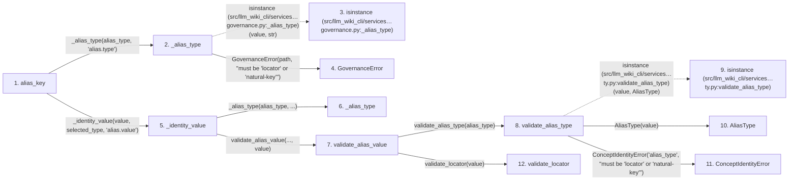

# alias_key

**Entry point:** `alias_key` (`api`)
**Source:** [knowledge_governance](../modules/knowledge_governance.md)
**Modules touched:** [concept_identity](../modules/concept_identity.md), [knowledge_governance](../modules/knowledge_governance.md), [wiki_surface](../modules/wiki_surface.md)

## Call sequence

```mermaid
sequenceDiagram
    participant p0 as alias_key
    participant p1 as _alias_type
    participant p2 as isinstance (src/llm_wiki_cli/services…governance.py:_alias_type)
    participant p3 as GovernanceError
    participant p4 as _identity_value
    participant p5 as validate_alias_value
    participant p6 as validate_alias_type
    participant p7 as isinstance (src/llm_wiki_cli/services…ty.py:validate_alias_type)
    participant p8 as AliasType
    participant p9 as ConceptIdentityError
    participant p10 as validate_locator
    participant p11 as _machine_text
    participant p12 as isinstance (src/llm_wiki_cli/services…identity.py:_machine_text)
    participant p13 as len (src/llm_wiki_cli/services…identity.py:_machine_text)
    participant p14 as value.strip (src/llm_wiki_cli/services…identity.py:_machine_text)
    participant p15 as any (src/llm_wiki_cli/services…identity.py:_machine_text)
    participant p16 as character.isspace (src/llm_wiki_cli/services…identity.py:_machine_text)
    participant p17 as unicodedata.normalize (src/llm_wiki_cli/services…identity.py:_machine_text)
    participant p18 as unicodedata.category(…).startswith (src/llm_wiki_cli/services…identity.py:_machine_text)
    participant p19 as unicodedata.category (src/llm_wiki_cli/services…identity.py:_machine_text)
    participant p20 as _contains_uri_userinfo
    participant p21 as urlsplit
    participant p22 as _looks_absolute_path
    participant p23 as value.startswith
    p0->>p1: _alias_type
    p1-->>p2: isinstance (src/llm_wiki_cli/services…governance.py:_alias_type)
    p1->>p3: GovernanceError
    p0->>p4: _identity_value
    p4->>p1: _alias_type
    p4->>p5: validate_alias_value
    p5->>p6: validate_alias_type
    p6-->>p7: isinstance (src/llm_wiki_cli/services…ty.py:validate_alias_type)
    p6->>p8: AliasType
    p6->>p9: ConceptIdentityError
    p5->>p10: validate_locator
    p10->>p11: _machine_text
    p11-->>p12: isinstance (src/llm_wiki_cli/services…identity.py:_machine_text)
    p11->>p9: ConceptIdentityError
    p11-->>p13: len (src/llm_wiki_cli/services…identity.py:_machine_text)
    p11->>p9: ConceptIdentityError
    p11-->>p14: value.strip (src/llm_wiki_cli/services…identity.py:_machine_text)
    p11-->>p15: any (src/llm_wiki_cli/services…identity.py:_machine_text)
    p11-->>p16: character.isspace (src/llm_wiki_cli/services…identity.py:_machine_text)
    p11->>p9: ConceptIdentityError
    p11-->>p17: unicodedata.normalize (src/llm_wiki_cli/services…identity.py:_machine_text)
    p11->>p9: ConceptIdentityError
    p11-->>p15: any (src/llm_wiki_cli/services…identity.py:_machine_text)
    p11-->>p18: unicodedata.category(…).startswith (src/llm_wiki_cli/services…identity.py:_machine_text)
    p11-->>p19: unicodedata.category (src/llm_wiki_cli/services…identity.py:_machine_text)
    p11->>p9: ConceptIdentityError
    p10->>p20: _contains_uri_userinfo
    p20-->>p21: urlsplit
    p10->>p22: _looks_absolute_path
    p22-->>p23: value.startswith
```

<!-- Auto-generated from static call edges. Dashed arrows are external or unresolved calls. Reviewed runtime conditions and side effects belong in Behavior. -->

> Call sequence diagram shows 30 of 106 interactions; 76 omitted to keep the visualization within the 30-interaction and generated-diagram limits.

> Trace truncated at the depth limit; deeper calls are omitted.

## Data flow

<!-- Auto-generated static analysis. Treat values and boundaries as best-effort hints, not runtime proof. -->

### Step data

| Step | Inputs | Reads | Writes | Returns |
|---|---|---|---|---|
| `alias_key` | `alias_type: str`, `value: str` | - | - | `...` |
| `_alias_type` | `value: object`, `path: str` | `ALIAS_TYPES` | - | `value` |
| `isinstance (src/llm_wiki_cli/services…governance.py:_alias_type)` | - | - | - | - |
| `GovernanceError` | - | - | - | - |
| `_identity_value` | `value: object`, `alias_type: str`, `path: str` | `ALIAS_LOCATOR`, `AliasType`, `AliasType`, `ConceptIdentityError` | - | `validate_alias_value(...)` |
| `_alias_type` | `value: object`, `path: str` | `ALIAS_TYPES` | - | `value` |
| `validate_alias_value` | `alias_type: AliasType \| str`, `value: object` | `AliasType` | - | `validate_locator(...)`, `validate_natural_key(...)` |
| `validate_alias_type` | `value: AliasType \| str` | `AliasType` | - | `...` |
| `isinstance (src/llm_wiki_cli/services…ty.py:validate_alias_type)` | - | - | - | - |
| `AliasType` | - | - | - | - |
| `ConceptIdentityError` | - | - | - | - |
| `validate_locator` | `value: object` | `_MAX_NATURAL_KEY_LENGTH`, `WikiSurfaceError` | - | `normalized` |

### Call data

| From | To | Line | Call |
|---|---|---:|---|
| alias_key | _alias_type | 379 | `_alias_type(alias_type, 'alias.type')` |
| _alias_type | isinstance (src/llm_wiki_cli/services…governance.py:_alias_type) | 3264 | `isinstance(value, str)` |
| _alias_type | GovernanceError | 3265 | `GovernanceError(path, "must be 'locator' or 'natural-key'")` |
| alias_key | _identity_value | 380 | `_identity_value(value, selected_type, 'alias.value')` |
| _identity_value | _alias_type | 3273 | `_alias_type(alias_type, ...)` |
| _identity_value | validate_alias_value | 3275 | `validate_alias_value(..., value)` |
| validate_alias_value | validate_alias_type | 456 | `validate_alias_type(alias_type)` |
| validate_alias_type | isinstance (src/llm_wiki_cli/services…ty.py:validate_alias_type) | 445 | `isinstance(value, AliasType)` |
| validate_alias_type | AliasType | 445 | `AliasType(value)` |
| validate_alias_type | ConceptIdentityError | 447 | `ConceptIdentityError('alias_type', "must be 'locator' or 'natural-key'")` |
| validate_alias_value | validate_locator | 458 | `validate_locator(value)` |

### Boundary effects

*No boundary effects detected.*

### Static analysis gaps

| Kind | Step | Target | Line |
|---|---|---|---:|
| external_call | `_alias_type` | `isinstance` | 3264 |
| external_call | `validate_alias_type` | `isinstance` | 445 |
| step_limit | `alias_key` | `first 12 steps` | 0 |
| truncated_flow | `alias_key` | `depth limit` | 0 |

## Behavior

This flow starts at `alias_key` and is classified as `api`. The generated call and data-flow sections are bounded static projections; runtime conditions and side effects require source-level confirmation.
