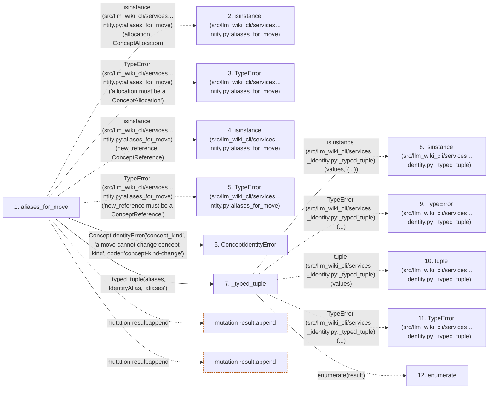

# aliases_for_move

**Entry point:** `aliases_for_move` (`api`)
**Source:** [concept_identity](../modules/concept_identity.md)
**Modules touched:** [concept_identity](../modules/concept_identity.md), [wiki_surface](../modules/wiki_surface.md)

## Call sequence

```mermaid
sequenceDiagram
    participant p0 as aliases_for_move
    participant p1 as isinstance (src/llm_wiki_cli/services…ntity.py:aliases_for_move)
    participant p2 as TypeError (src/llm_wiki_cli/services…ntity.py:aliases_for_move)
    participant p3 as ConceptIdentityError
    participant p4 as _typed_tuple
    participant p5 as isinstance (src/llm_wiki_cli/services…_identity.py:_typed_tuple)
    participant p6 as TypeError (src/llm_wiki_cli/services…_identity.py:_typed_tuple)
    participant p7 as tuple (src/llm_wiki_cli/services…_identity.py:_typed_tuple)
    participant p8 as enumerate
    participant p9 as identity_coordinate_key
    participant p10 as validate_alias_type
    participant p11 as isinstance (src/llm_wiki_cli/services…ty.py:validate_alias_type)
    participant p12 as AliasType
    participant p13 as validate_alias_value
    participant p14 as validate_locator
    participant p15 as _machine_text
    participant p16 as isinstance (src/llm_wiki_cli/services…identity.py:_machine_text)
    participant p17 as len (src/llm_wiki_cli/services…identity.py:_machine_text)
    participant p18 as value.strip (src/llm_wiki_cli/services…identity.py:_machine_text)
    participant p19 as any (src/llm_wiki_cli/services…identity.py:_machine_text)
    participant p20 as character.isspace (src/llm_wiki_cli/services…identity.py:_machine_text)
    p0-->>p1: isinstance (src/llm_wiki_cli/services…ntity.py:aliases_for_move)
    p0-->>p2: TypeError (src/llm_wiki_cli/services…ntity.py:aliases_for_move)
    p0-->>p1: isinstance (src/llm_wiki_cli/services…ntity.py:aliases_for_move)
    p0-->>p2: TypeError (src/llm_wiki_cli/services…ntity.py:aliases_for_move)
    p0->>p3: ConceptIdentityError
    p0->>p4: _typed_tuple
    p4-->>p5: isinstance (src/llm_wiki_cli/services…_identity.py:_typed_tuple)
    p4-->>p6: TypeError (src/llm_wiki_cli/services…_identity.py:_typed_tuple)
    p4-->>p7: tuple (src/llm_wiki_cli/services…_identity.py:_typed_tuple)
    p4-->>p6: TypeError (src/llm_wiki_cli/services…_identity.py:_typed_tuple)
    p4-->>p8: enumerate
    p4-->>p5: isinstance (src/llm_wiki_cli/services…_identity.py:_typed_tuple)
    p4-->>p6: TypeError (src/llm_wiki_cli/services…_identity.py:_typed_tuple)
    p0->>p9: identity_coordinate_key
    p9->>p10: validate_alias_type
    p10-->>p11: isinstance (src/llm_wiki_cli/services…ty.py:validate_alias_type)
    p10->>p12: AliasType
    p10->>p3: ConceptIdentityError
    p9->>p13: validate_alias_value
    p13->>p10: validate_alias_type
    p13->>p14: validate_locator
    p14->>p15: _machine_text
    p15-->>p16: isinstance (src/llm_wiki_cli/services…identity.py:_machine_text)
    p15->>p3: ConceptIdentityError
    p15-->>p17: len (src/llm_wiki_cli/services…identity.py:_machine_text)
    p15->>p3: ConceptIdentityError
    p15-->>p18: value.strip (src/llm_wiki_cli/services…identity.py:_machine_text)
    p15-->>p19: any (src/llm_wiki_cli/services…identity.py:_machine_text)
    p15-->>p20: character.isspace (src/llm_wiki_cli/services…identity.py:_machine_text)
    p15->>p3: ConceptIdentityError
```

<!-- Auto-generated from static call edges. Dashed arrows are external or unresolved calls. Reviewed runtime conditions and side effects belong in Behavior. -->

> Call sequence diagram shows 30 of 141 interactions; 111 omitted to keep the visualization within the 30-interaction and generated-diagram limits.

> Trace truncated at the depth limit; deeper calls are omitted.

## Data flow

<!-- Auto-generated static analysis. Treat values and boundaries as best-effort hints, not runtime proof. -->

### Step data

| Step | Inputs | Reads | Writes | Returns |
|---|---|---|---|---|
| `aliases_for_move` | `allocation: ConceptAllocation`, `new_reference: ConceptReference`, `aliases: Iterable[IdentityAlias]` | `ConceptAllocation`, `ConceptReference`, `IdentityAlias`, `AliasType`, `AliasType`, `AliasType`, `AliasType`, `AliasType` | - | `_deduplicated_aliases(...)` |
| `isinstance (src/llm_wiki_cli/services…ntity.py:aliases_for_move)` | - | - | - | - |
| `TypeError (src/llm_wiki_cli/services…ntity.py:aliases_for_move)` | - | - | - | - |
| `isinstance (src/llm_wiki_cli/services…ntity.py:aliases_for_move)` | - | - | - | - |
| `TypeError (src/llm_wiki_cli/services…ntity.py:aliases_for_move)` | - | - | - | - |
| `ConceptIdentityError` | - | - | - | - |
| `_typed_tuple` | `values: Iterable[_RecordT]`, `expected_type: type[_RecordT]`, `field: str` | - | - | `result` |
| `isinstance (src/llm_wiki_cli/services…_identity.py:_typed_tuple)` | - | - | - | - |
| `TypeError (src/llm_wiki_cli/services…_identity.py:_typed_tuple)` | - | - | - | - |
| `tuple (src/llm_wiki_cli/services…_identity.py:_typed_tuple)` | - | - | - | - |
| `TypeError (src/llm_wiki_cli/services…_identity.py:_typed_tuple)` | - | - | - | - |
| `enumerate` | - | - | - | - |

### Call data

| From | To | Line | Call |
|---|---|---:|---|
| aliases_for_move | isinstance (src/llm_wiki_cli/services…ntity.py:aliases_for_move) | 757 | `isinstance(allocation, ConceptAllocation)` |
| aliases_for_move | TypeError (src/llm_wiki_cli/services…ntity.py:aliases_for_move) | 758 | `TypeError('allocation must be a ConceptAllocation')` |
| aliases_for_move | isinstance (src/llm_wiki_cli/services…ntity.py:aliases_for_move) | 759 | `isinstance(new_reference, ConceptReference)` |
| aliases_for_move | TypeError (src/llm_wiki_cli/services…ntity.py:aliases_for_move) | 760 | `TypeError('new_reference must be a ConceptReference')` |
| aliases_for_move | ConceptIdentityError | 762 | `ConceptIdentityError('concept_kind', 'a move cannot change concept kind', code='concept-kind-change')` |
| aliases_for_move | _typed_tuple | 767 | `_typed_tuple(aliases, IdentityAlias, 'aliases')` |
| _typed_tuple | isinstance (src/llm_wiki_cli/services…_identity.py:_typed_tuple) | 983 | `isinstance(values, (...))` |
| _typed_tuple | TypeError (src/llm_wiki_cli/services…_identity.py:_typed_tuple) | 984 | `TypeError(...)` |
| _typed_tuple | tuple (src/llm_wiki_cli/services…_identity.py:_typed_tuple) | 986 | `tuple(values)` |
| _typed_tuple | TypeError (src/llm_wiki_cli/services…_identity.py:_typed_tuple) | 988 | `TypeError(...)` |
| _typed_tuple | enumerate | 991 | `enumerate(result)` |

### Boundary effects

| Kind | Target | Step | Line |
|---|---|---|---:|
| mutation | `result.append` | `aliases_for_move` | 790 |
| mutation | `result.append` | `aliases_for_move` | 801 |

### Static analysis gaps

| Kind | Step | Target | Line |
|---|---|---|---:|
| external_call | `aliases_for_move` | `isinstance` | 757 |
| external_call | `aliases_for_move` | `TypeError` | 758 |
| external_call | `aliases_for_move` | `isinstance` | 759 |
| external_call | `aliases_for_move` | `TypeError` | 760 |
| external_call | `_typed_tuple` | `isinstance` | 983 |
| external_call | `_typed_tuple` | `TypeError` | 984 |
| external_call | `_typed_tuple` | `TypeError` | 988 |
| external_call | `_typed_tuple` | `enumerate` | 991 |
| step_limit | `aliases_for_move` | `first 12 steps` | 0 |
| truncated_flow | `aliases_for_move` | `depth limit` | 0 |

## Behavior

This flow starts at `aliases_for_move` and is classified as `api`. The generated call and data-flow sections are bounded static projections; runtime conditions and side effects require source-level confirmation.
