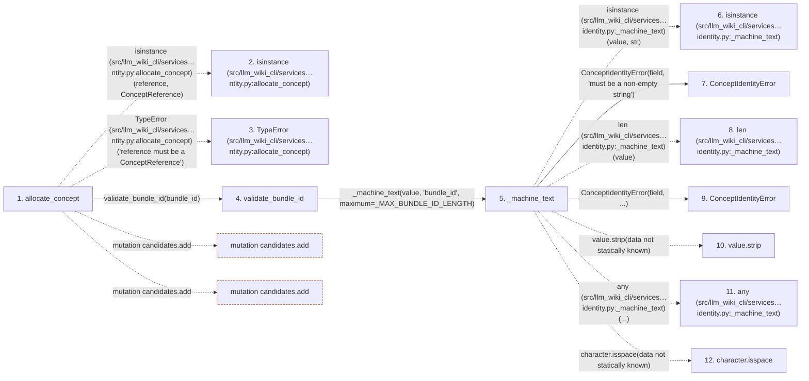

# allocate_concept

**Entry point:** `allocate_concept` (`api`)
**Source:** [concept_identity](../modules/concept_identity.md)
**Modules touched:** [concept_identity](../modules/concept_identity.md), [wiki_surface](../modules/wiki_surface.md)

## Call sequence

```mermaid
sequenceDiagram
    participant p0 as allocate_concept
    participant p1 as isinstance (src/llm_wiki_cli/services…ntity.py:allocate_concept)
    participant p2 as TypeError (src/llm_wiki_cli/services…ntity.py:allocate_concept)
    participant p3 as validate_bundle_id
    participant p4 as _machine_text
    participant p5 as isinstance (src/llm_wiki_cli/services…identity.py:_machine_text)
    participant p6 as ConceptIdentityError
    participant p7 as len (src/llm_wiki_cli/services…identity.py:_machine_text)
    participant p8 as value.strip
    participant p9 as any (src/llm_wiki_cli/services…identity.py:_machine_text)
    participant p10 as character.isspace
    participant p11 as unicodedata.normalize
    participant p12 as unicodedata.category(…).startswith
    participant p13 as unicodedata.category
    participant p14 as _BUNDLE_ID_RE.fullmatch
    participant p15 as text.casefold
    participant p16 as _looks_absolute_path
    participant p17 as value.startswith
    participant p18 as _WINDOWS_ABSOLUTE_RE.match
    participant p19 as _contains_uri_userinfo
    participant p20 as urlsplit
    participant p21 as validate_identity_registry
    participant p22 as _typed_tuple
    participant p23 as isinstance (src/llm_wiki_cli/services…_identity.py:_typed_tuple)
    participant p24 as TypeError (src/llm_wiki_cli/services…_identity.py:_typed_tuple)
    p0-->>p1: isinstance (src/llm_wiki_cli/services…ntity.py:allocate_concept)
    p0-->>p2: TypeError (src/llm_wiki_cli/services…ntity.py:allocate_concept)
    p0->>p3: validate_bundle_id
    p3->>p4: _machine_text
    p4-->>p5: isinstance (src/llm_wiki_cli/services…identity.py:_machine_text)
    p4->>p6: ConceptIdentityError
    p4-->>p7: len (src/llm_wiki_cli/services…identity.py:_machine_text)
    p4->>p6: ConceptIdentityError
    p4-->>p8: value.strip
    p4-->>p9: any (src/llm_wiki_cli/services…identity.py:_machine_text)
    p4-->>p10: character.isspace
    p4->>p6: ConceptIdentityError
    p4-->>p11: unicodedata.normalize
    p4->>p6: ConceptIdentityError
    p4-->>p9: any (src/llm_wiki_cli/services…identity.py:_machine_text)
    p4-->>p12: unicodedata.category(…).startswith
    p4-->>p13: unicodedata.category
    p4->>p6: ConceptIdentityError
    p3-->>p14: _BUNDLE_ID_RE.fullmatch
    p3-->>p15: text.casefold
    p3->>p16: _looks_absolute_path
    p16-->>p17: value.startswith
    p16-->>p18: _WINDOWS_ABSOLUTE_RE.match
    p3->>p19: _contains_uri_userinfo
    p19-->>p20: urlsplit
    p3->>p6: ConceptIdentityError
    p0->>p21: validate_identity_registry
    p21->>p22: _typed_tuple
    p22-->>p23: isinstance (src/llm_wiki_cli/services…_identity.py:_typed_tuple)
    p22-->>p24: TypeError (src/llm_wiki_cli/services…_identity.py:_typed_tuple)
```

<!-- Auto-generated from static call edges. Dashed arrows are external or unresolved calls. Reviewed runtime conditions and side effects belong in Behavior. -->

> Call sequence diagram shows 30 of 193 interactions; 163 omitted to keep the visualization within the 30-interaction and generated-diagram limits.

> Trace truncated at the depth limit; deeper calls are omitted.

## Data flow

<!-- Auto-generated static analysis. Treat values and boundaries as best-effort hints, not runtime proof. -->

### Step data

| Step | Inputs | Reads | Writes | Returns |
|---|---|---|---|---|
| `allocate_concept` | `bundle_id: object`, `reference: ConceptReference`, `allocations: Iterable[ConceptAllocation]`, `aliases: Iterable[IdentityAlias]` | `ConceptReference`, `AliasType`, `AliasType`, `AliasType`, `AliasType` | - | `allocation`, `ConceptAllocation(...)` |
| `isinstance (src/llm_wiki_cli/services…ntity.py:allocate_concept)` | - | - | - | - |
| `TypeError (src/llm_wiki_cli/services…ntity.py:allocate_concept)` | - | - | - | - |
| `validate_bundle_id` | `value: object` | `_MAX_BUNDLE_ID_LENGTH` | - | `text` |
| `_machine_text` | `value: object`, `field: str`, `maximum: int` | - | - | `value` |
| `isinstance (src/llm_wiki_cli/services…identity.py:_machine_text)` | - | - | - | - |
| `ConceptIdentityError` | - | - | - | - |
| `len (src/llm_wiki_cli/services…identity.py:_machine_text)` | - | - | - | - |
| `ConceptIdentityError` | - | - | - | - |
| `value.strip` | - | - | - | - |
| `any (src/llm_wiki_cli/services…identity.py:_machine_text)` | - | - | - | - |
| `character.isspace` | - | - | - | - |

### Call data

| From | To | Line | Call |
|---|---|---:|---|
| allocate_concept | isinstance (src/llm_wiki_cli/services…ntity.py:allocate_concept) | 537 | `isinstance(reference, ConceptReference)` |
| allocate_concept | TypeError (src/llm_wiki_cli/services…ntity.py:allocate_concept) | 538 | `TypeError('reference must be a ConceptReference')` |
| allocate_concept | validate_bundle_id | 539 | `validate_bundle_id(bundle_id)` |
| validate_bundle_id | _machine_text | 288 | `_machine_text(value, 'bundle_id', maximum=_MAX_BUNDLE_ID_LENGTH)` |
| _machine_text | isinstance (src/llm_wiki_cli/services…identity.py:_machine_text) | 912 | `isinstance(value, str)` |
| _machine_text | ConceptIdentityError | 913 | `ConceptIdentityError(field, 'must be a non-empty string')` |
| _machine_text | len (src/llm_wiki_cli/services…identity.py:_machine_text) | 914 | `len(value)` |
| _machine_text | ConceptIdentityError | 915 | `ConceptIdentityError(field, ...)` |
| _machine_text | value.strip | 916 | `value.strip(data not statically known)` |
| _machine_text | any (src/llm_wiki_cli/services…identity.py:_machine_text) | 916 | `any(...)` |
| _machine_text | character.isspace | 916 | `character.isspace(data not statically known)` |

### Boundary effects

| Kind | Target | Step | Line |
|---|---|---|---:|
| mutation | `candidates.add` | `allocate_concept` | 556 |
| mutation | `candidates.add` | `allocate_concept` | 566 |

### Static analysis gaps

| Kind | Step | Target | Line |
|---|---|---|---:|
| external_call | `allocate_concept` | `isinstance` | 537 |
| external_call | `allocate_concept` | `TypeError` | 538 |
| external_call | `_machine_text` | `isinstance` | 912 |
| unresolved_call | `_machine_text` | `value.strip` | 916 |
| external_call | `_machine_text` | `any` | 916 |
| unresolved_call | `_machine_text` | `character.isspace` | 916 |
| step_limit | `allocate_concept` | `first 12 steps` | 0 |
| truncated_flow | `allocate_concept` | `depth limit` | 0 |

## Behavior

This flow starts at `allocate_concept` and is classified as `api`. The generated call and data-flow sections are bounded static projections; runtime conditions and side effects require source-level confirmation.
