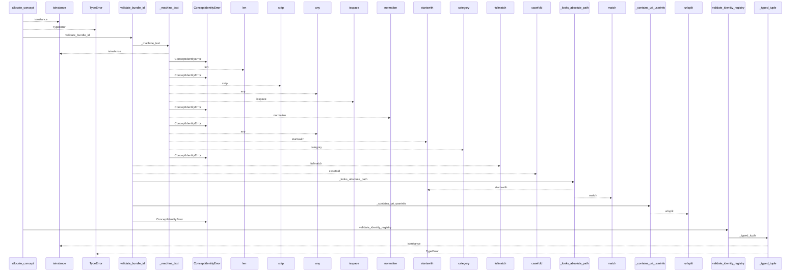
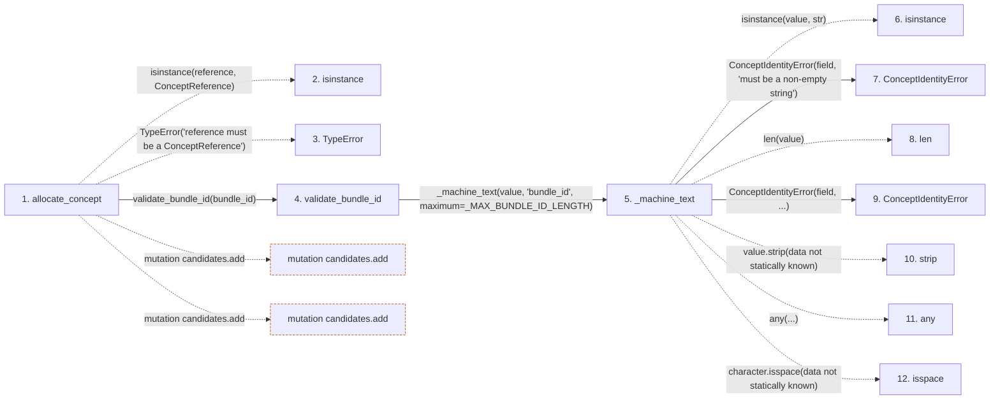

# allocate_concept

**Entry point:** `allocate_concept` (`api`)
**Source:** [concept_identity](../modules/concept_identity.md)
**Modules touched:** [concept_identity](../modules/concept_identity.md), [wiki_surface](../modules/wiki_surface.md)

## Call sequence

<!-- Auto-generated from static call edges. Dashed arrows are external or unresolved calls. Reviewed runtime conditions and side effects belong in Behavior. -->

> Call sequence diagram shows 30 of 193 interactions; 163 omitted to keep the visualization within the 30-interaction and generated-diagram limits.

> Trace truncated at the depth limit; deeper calls are omitted.

## Data flow

<!-- Auto-generated static analysis. Treat values and boundaries as best-effort hints, not runtime proof. -->

### Step data

| Step | Inputs | Reads | Writes | Returns |
|---|---|---|---|---|
| `allocate_concept` | `bundle_id: object`, `reference: ConceptReference`, `allocations: Iterable[ConceptAllocation]`, `aliases: Iterable[IdentityAlias]` | `ConceptReference`, `AliasType`, `AliasType`, `AliasType`, `AliasType` | - | `allocation`, `ConceptAllocation(...)` |
| `isinstance` | - | - | - | - |
| `TypeError` | - | - | - | - |
| `validate_bundle_id` | `value: object` | `_MAX_BUNDLE_ID_LENGTH` | - | `text` |
| `_machine_text` | `value: object`, `field: str`, `maximum: int` | - | - | `value` |
| `isinstance` | - | - | - | - |
| `ConceptIdentityError` | - | - | - | - |
| `len` | - | - | - | - |
| `ConceptIdentityError` | - | - | - | - |
| `strip` | - | - | - | - |
| `any` | - | - | - | - |
| `isspace` | - | - | - | - |

### Call data

| From | To | Line | Call |
|---|---|---:|---|
| allocate_concept | isinstance | 537 | `isinstance(reference, ConceptReference)` |
| allocate_concept | TypeError | 538 | `TypeError('reference must be a ConceptReference')` |
| allocate_concept | validate_bundle_id | 539 | `validate_bundle_id(bundle_id)` |
| validate_bundle_id | _machine_text | 288 | `_machine_text(value, 'bundle_id', maximum=_MAX_BUNDLE_ID_LENGTH)` |
| _machine_text | isinstance | 912 | `isinstance(value, str)` |
| _machine_text | ConceptIdentityError | 913 | `ConceptIdentityError(field, 'must be a non-empty string')` |
| _machine_text | len | 914 | `len(value)` |
| _machine_text | ConceptIdentityError | 915 | `ConceptIdentityError(field, ...)` |
| _machine_text | strip | 916 | `value.strip(data not statically known)` |
| _machine_text | any | 916 | `any(...)` |
| _machine_text | isspace | 916 | `character.isspace(data not statically known)` |

### Boundary effects

| Kind | Target | Step | Line |
|---|---|---|---:|
| mutation | `candidates.add` | `allocate_concept` | 556 |
| mutation | `candidates.add` | `allocate_concept` | 566 |

### Static analysis gaps

| Kind | Step | Target | Line |
|---|---|---|---:|
| unresolved_call | `allocate_concept` | `isinstance` | 537 |
| unresolved_call | `allocate_concept` | `TypeError` | 538 |
| unresolved_call | `_machine_text` | `isinstance` | 912 |
| unresolved_call | `_machine_text` | `value.strip` | 916 |
| unresolved_call | `_machine_text` | `any` | 916 |
| unresolved_call | `_machine_text` | `character.isspace` | 916 |
| step_limit | `allocate_concept` | `first 12 steps` | 0 |
| truncated_flow | `allocate_concept` | `depth limit` | 0 |

## Behavior

This flow starts at `allocate_concept` and is classified as `api`. The generated call and data-flow sections are bounded static projections; runtime conditions and side effects require source-level confirmation.
