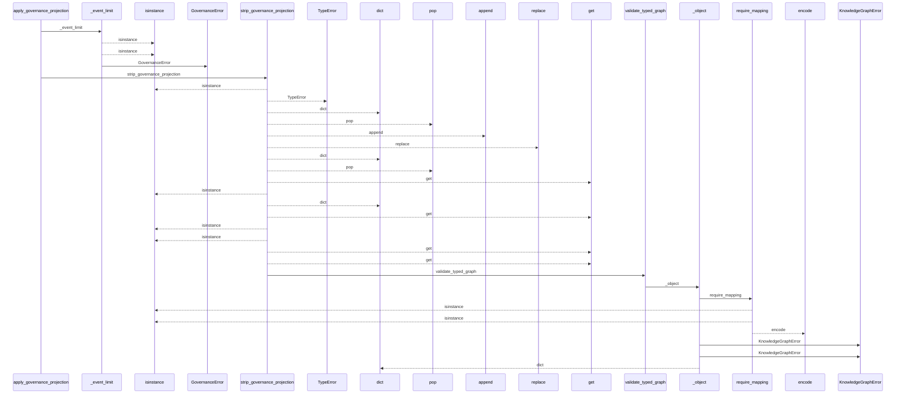
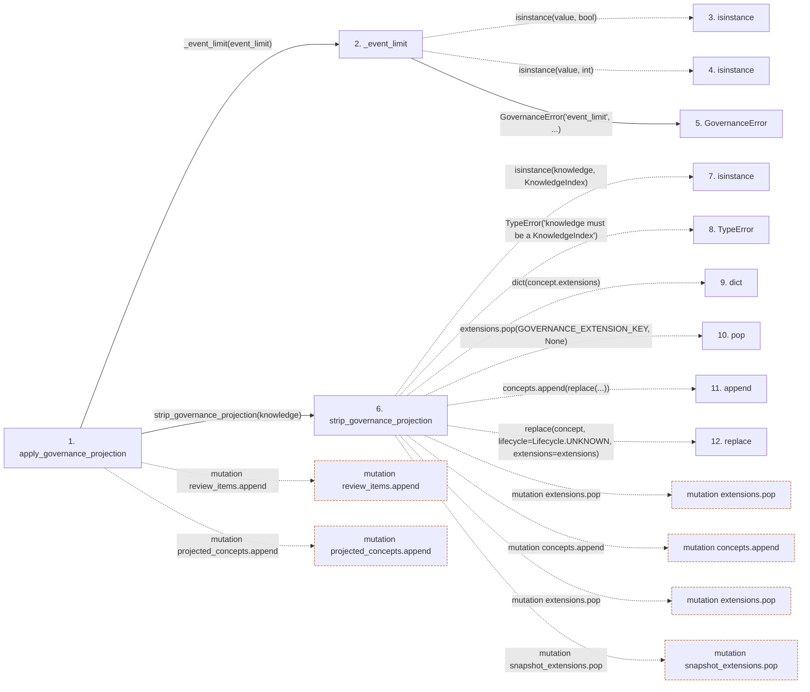

# apply_governance_projection

**Entry point:** `apply_governance_projection` (`api`)
**Source:** [knowledge_governance](../modules/knowledge_governance.md)
**Modules touched:** [concept_identity](../modules/concept_identity.md), [knowledge_evidence](../modules/knowledge_evidence.md), [knowledge_governance](../modules/knowledge_governance.md), and 5 more

**Complete modules touched:**

- [concept_identity](../modules/concept_identity.md)
- [knowledge_evidence](../modules/knowledge_evidence.md)
- [knowledge_governance](../modules/knowledge_governance.md)
- [knowledge_graph](../modules/knowledge_graph.md)
- [knowledge_model](../modules/knowledge_model.md)
- [validation](../modules/validation.md)
- [wiki_media](../modules/wiki_media.md)
- [wiki_surface](../modules/wiki_surface.md)

## Call sequence

<!-- Auto-generated from static call edges. Dashed arrows are external or unresolved calls. Reviewed runtime conditions and side effects belong in Behavior. -->

> Call sequence diagram shows 30 of 1394 interactions; 1364 omitted to keep the visualization within the 30-interaction and generated-diagram limits.

> Trace truncated at the depth limit; deeper calls are omitted.

## Data flow

<!-- Auto-generated static analysis. Treat values and boundaries as best-effort hints, not runtime proof. -->

### Step data

| Step | Inputs | Reads | Writes | Returns |
|---|---|---|---|---|
| `apply_governance_projection` | `knowledge: KnowledgeIndex`, `ledger: GovernanceLedger`, `event_limit: int` | `GOVERNANCE_SCHEMA_VERSION`, `INVENTORY_HASH_EXTENSION` | `summary[...]`, `concept_summaries[...]`, `concept_extensions[...]`, `extensions[...]`, `snapshot_extensions[...]` | `projected` |
| `_event_limit` | `value: object` | `MAX_EVENT_LIMIT`, `MAX_EVENT_LIMIT` | - | `value` |
| `isinstance` | - | - | - | - |
| `isinstance` | - | - | - | - |
| `GovernanceError` | - | - | - | - |
| `strip_governance_projection` | `knowledge: KnowledgeIndex` | `KnowledgeIndex`, `GOVERNANCE_EXTENSION_KEY`, `Lifecycle`, `GOVERNANCE_EXTENSION_KEY`, `Mapping`, `Mapping`, `ConceptKind`, `GOVERNANCE_HASH_EXTENSION_KEY` | `graph_payload[...]`, `extensions[...]` | `replace(...)` |
| `isinstance` | - | - | - | - |
| `TypeError` | - | - | - | - |
| `dict` | - | - | - | - |
| `pop` | - | - | - | - |
| `append` | - | - | - | - |
| `replace` | - | - | - | - |

### Call data

| From | To | Line | Call |
|---|---|---:|---|
| apply_governance_projection | _event_limit | 1680 | `_event_limit(event_limit)` |
| _event_limit | isinstance | 2545 | `isinstance(value, bool)` |
| _event_limit | isinstance | 2546 | `isinstance(value, int)` |
| _event_limit | GovernanceError | 2549 | `GovernanceError('event_limit', ...)` |
| apply_governance_projection | strip_governance_projection | 1681 | `strip_governance_projection(knowledge)` |
| strip_governance_projection | isinstance | 1613 | `isinstance(knowledge, KnowledgeIndex)` |
| strip_governance_projection | TypeError | 1614 | `TypeError('knowledge must be a KnowledgeIndex')` |
| strip_governance_projection | dict | 1617 | `dict(concept.extensions)` |
| strip_governance_projection | pop | 1618 | `extensions.pop(GOVERNANCE_EXTENSION_KEY, None)` |
| strip_governance_projection | append | 1619 | `concepts.append(replace(...))` |
| strip_governance_projection | replace | 1620 | `replace(concept, lifecycle=Lifecycle.UNKNOWN, extensions=extensions)` |

### Boundary effects

| Kind | Target | Step | Line |
|---|---|---|---:|
| mutation | `review_items.append` | `apply_governance_projection` | 1735 |
| mutation | `projected_concepts.append` | `apply_governance_projection` | 1760 |
| mutation | `extensions.pop` | `strip_governance_projection` | 1618 |
| mutation | `concepts.append` | `strip_governance_projection` | 1619 |
| mutation | `extensions.pop` | `strip_governance_projection` | 1627 |
| mutation | `snapshot_extensions.pop` | `strip_governance_projection` | 1656 |

### Static analysis gaps

| Kind | Step | Target | Line |
|---|---|---|---:|
| unresolved_call | `_event_limit` | `isinstance` | 2545 |
| unresolved_call | `_event_limit` | `isinstance` | 2546 |
| unresolved_call | `strip_governance_projection` | `isinstance` | 1613 |
| unresolved_call | `strip_governance_projection` | `TypeError` | 1614 |
| external_call | `strip_governance_projection` | `replace` | 1620 |
| step_limit | `apply_governance_projection` | `first 12 steps` | 0 |
| truncated_flow | `apply_governance_projection` | `depth limit` | 0 |

## Behavior

This flow starts at `apply_governance_projection` and is classified as `api`. The generated call and data-flow sections are bounded static projections; runtime conditions and side effects require source-level confirmation.
